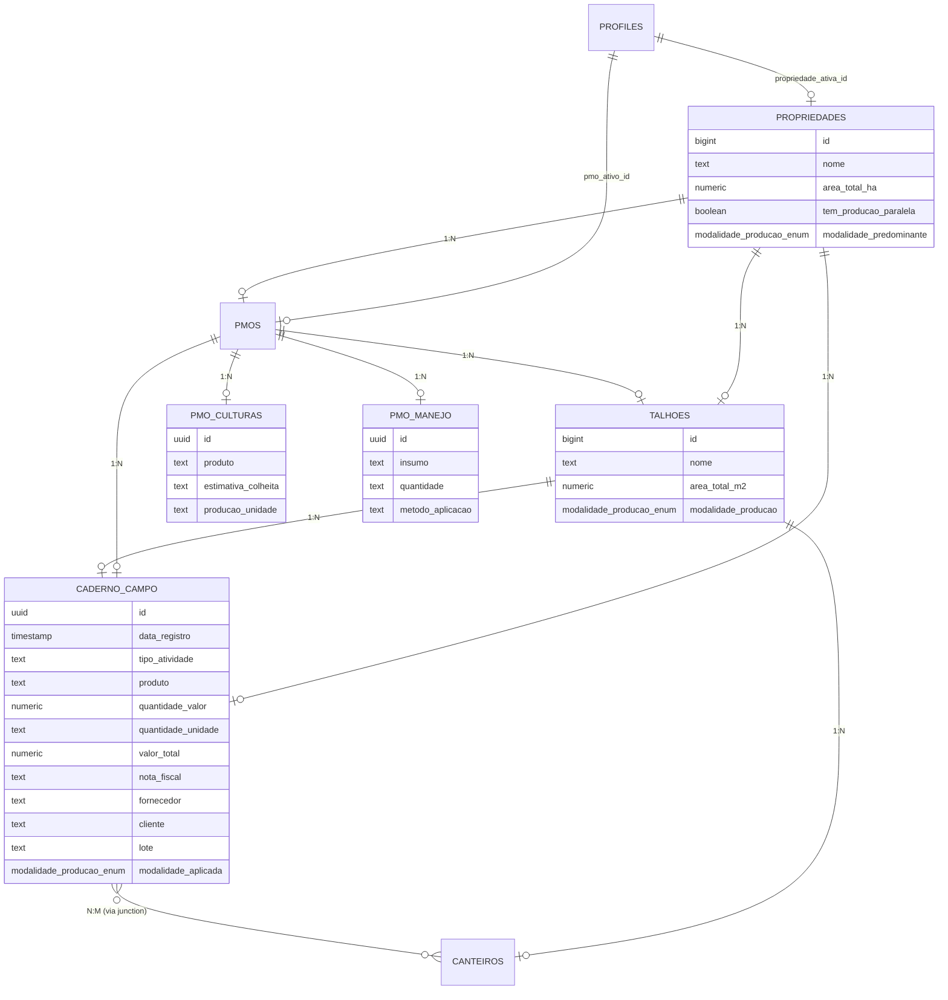

# CURRENT_SCHEMA_VISUALIZATION.md

## 1. Diagrama Entidade-Relacionamento (ER)
Este diagrama foca nas tabelas centrais e nos campos com impacto financeiro ou de rastreabilidade para o novo módulo.

## 2. Análise Crítica do Schema Atual

### ⚠️ As Armadilhas da "Força Bruta" no Módulo Financeiro

Olhando para a estrutura atual, as maiores armadilhas de tentar "chumbar" o financeiro dentro das tabelas existentes (principalmente no `caderno_campo`) são:

1. **Ambiguidade de Fluxo de Caixa (Inbound vs Outbound):**
   O `caderno_campo` mistura Compras, Vendas, Manejo e Limpeza. Sem uma flag clara de `direcao_fluxo` (Crédito/Débito) ou uma tabela de `categorias_financeiras`, relatórios de lucros e perdas (P&L) dependerão de filtros frágeis baseados em strings no campo `tipo_atividade`.

2. **Acoplamento Operacional-Financeiro (Granularidade):**
   Um registro de `caderno_campo` costuma ser atômico (ex: "Apliquei 2kg de adubo"). No financeiro, uma **única Nota Fiscal** de R$ 5.000,00 pode conter 10 insumos diferentes aplicados em meses distintos. Guardar o valor total da NF em cada linha de manejo causará **duplicidade massiva** de valores nos cálculos de saldo, ou exigirá uma lógica complexa de rateio que o schema atual não suporta.

3. **Falta de Tabela de "Preços de Referência":**
   Não temos uma tabela de `catalogo_insumos` com preços médios. Hoje, o valor é digitado pelo usuário (texto ou numérico livre). Sem um catálogo, não conseguimos calcular o "Custo de Reposição" ou "Custo Médio Ponderado" do estoque de forma automatizada.

4. **Inexistência de Estados de Liquidação:**
   Não há campos para `data_pagamento`, `metodo_pagamento` ou `status_conciliacao`. O sistema sabe que algo "ocorreu", mas não sabe se foi "pago". Forçar isso no `caderno_campo` transformaria uma tabela de auditoria agrícola em um ERP contábil incompleto.

### 💡 Recomendação do DBA
Para o Módulo Financeiro, o ideal é criar uma tabela `transacoes_financeiras` vinculada ao `pmo_id`, onde cada registro pode se associar a **N** registros do `caderno_campo`. Isso permite que uma única compra (NF) seja rateada tecnicamente entre vários manejos ou talhões.
