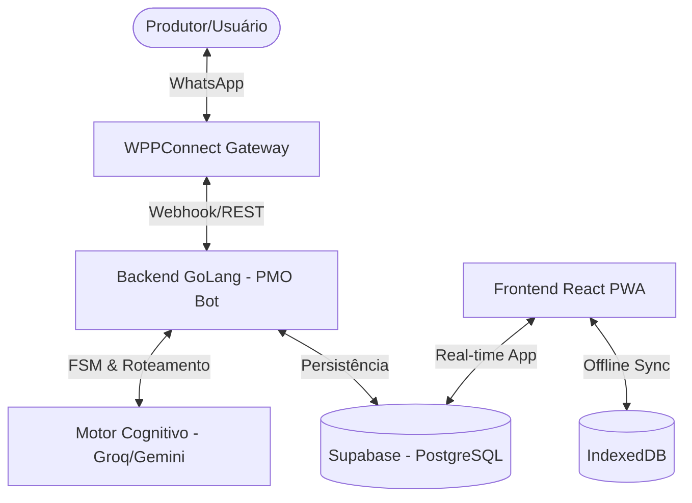

# 🌿 Manejo Orgânico - PMO Bot 🤖


Plataforma de **Inteligência Artificial de Grau Enterprise** para automação e gestão do manejo orgânico. O ecossistema integra um assistente inteligente via WhatsApp, um motor de processamento robusto em GoLang e um Dashboard administrativo moderno para visualização e compliance.

---

## 📐 Visão Geral da Arquitetura

O sistema utiliza uma arquitetura distribuída e baseada em eventos, garantindo alta disponibilidade e respostas em tempo real.


```mermaid
graph TD
    User([Produtor/Usuário]) <-->|WhatsApp| WPP[WPPConnect Gateway]
    WPP <-->|Webhook/REST| BE[Backend GoLang - PMO Bot]
    BE <-->|FSM & Roteamento| LLM[Motor Cognitivo - Groq/Gemini]
    BE <-->|Persistência| DB[(Supabase - PostgreSQL)]
    FE[Frontend React PWA] <-->|Real-time App| DB
    FE <-->|Offline Sync| IDB[(IndexedDB)]
```

### O Fluxo de Inteligência
1. **Frontend PWA**: Interface principal do usuário para gestão de talhões, canteiros e registros manuais. Opera em modo *Offline-first*.
2. **WhatsApp Bot**: Interface conversacional para agilidade no campo (textos e áudios).
3. **Backend GoLang (Orchestrator)**: Atua como roteador inteligente, orquestrando múltiplos agentes e gerenciando a Máquina de Estados (FSM).
4. **Declarative MCP & Fat Database**: 
   - **Postgres RPC**: Toda a lógica pesada de negócio (resolução de nomes, geração de lotes) reside no banco de dados via RPCs.
   - **Multi-Agent Engine**: Uso especializado de Groq e Gemini com prompts modulares (`agronomist`, `db_operator`).

---

## 📦 Módulos do Sistema

### 🖥️ Frontend (PWA)
Desenvolvido com **React 19 + Vite**, focado em performance e usabilidade no campo.
- **Offline-first**: Sincronização robusta via `idb` (IndexedDB) e Workbox.
- **Geolocalização**: Mapas interativos via **Leaflet** com estratégia de *GeoJSON Placeholder* for visualização precisa de talhões e canteiros.
- **Design System**: UI premium baseada na estética moderna com Tailwind CSS v4.

### ⚙️ Backend (GoLang - Thin Backend Layer)
Motor de alta performance focado em orquestração e roteamento.
- **FSM (Finite State Machine)**: Controle rigoroso dos estados da conversa, garantindo fluxos lineares e sem perda de contexto.
- **Declarative Operations**: Integração profunda com Supabase via RPCs, eliminando lógica imperativa complexa no código Go.
- **Security & Resilience**: Middlewares de proteção contra loops e recuperação de pânico em tempo real.

### 📊 Auditoria e Telemetria
- **Rigor Financeiro**: Logs de consumo detalhados por PMO ID e User ID.
- **Monitoramento**: Rastreabilidade total de tokens utilizados e tempos de resposta das LLMs.
- **Compliance**: Validação automática de insumos contra as normas de certificação orgânica.

---

## 🛠️ Setup Local (Orquestração Docker)

Para rodar o ecossistema completo localmente, siga os passos abaixo:

### 1. Pré-requisitos
- Docker & Docker Compose v2+
- Variáveis de ambiente configuradas (`.env` no backend e frontend)

### 2. Inicialização

Os serviços de infraestrutura e o motor Go estão centralizados no diretório `pmo_bot`.

```bash
# Navegue até o diretório do motor
cd pmo_bot

# Derrube qualquer instância anterior e limpe volumes se necessário
docker-compose down

# Suba os containers com rebuild forçado
docker-compose up -d --build
```

### 3. Serviços Disponíveis
- **API (pmo-bot-go)**: `http://localhost:8080/health`
- **WPPConnect Gateway**: `http://localhost:21465` (Porta do webhook central)
- **Frontend (Dev)**: `cd pmo-frontend && npm run dev`

---

## 📄 Licença e Uso

Este projeto é de uso restrito e privado. Todos os direitos reservados.

---
**Desenvolvido com 💚 para o Futuro do Manejo Orgânico.**
