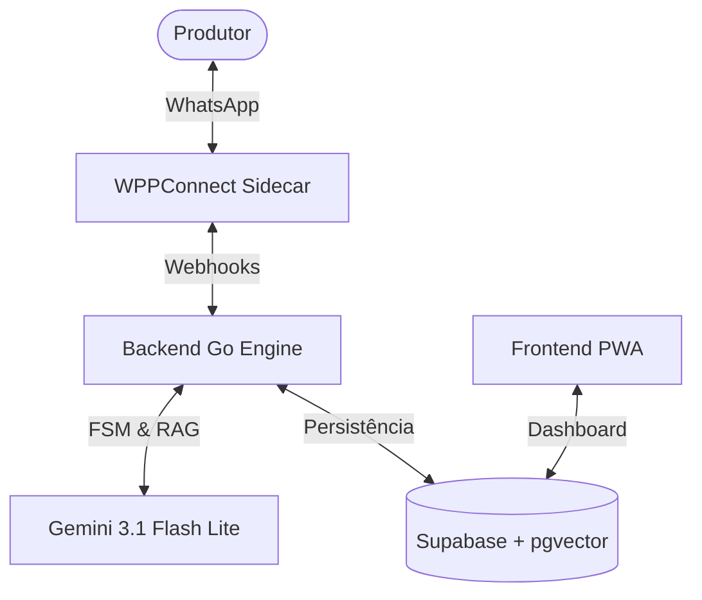

# 🌿 Manejo Orgânico Inteligente - Ecossistema Multiplataforma 🤖

[](https://go.dev/)
[](https://react.dev/)
[](https://web.dev/progressive-web-apps/)
[](https://www.docker.com/)
[](https://supabase.com/)
[](https://azure.microsoft.com/)

O **Ecossistema Multiplataforma de Manejo Orgânico Inteligente** é uma solução avançada para a gestão estratégica da produção orgânica brasileira. Utilizando Inteligência Artificial (RAG) e uma arquitetura resiliente, o sistema simplifica a burocracia do **Plano de Manejo Orgânico (PMO)** e oferece suporte técnico em tempo real para os produtores no campo.

---

## 📐 Arquitetura do Sistema (v2.0)

A plataforma opera em uma arquitetura de microserviços em containers, orquestrada para alta performance e baixa latência.


```mermaid
graph TD
    User([Produtor]) <-->|WhatsApp| WPP[WPPConnect Sidecar]
    WPP <-->|Webhooks| BE[Backend Go Engine]
    BE <-->|FSM & RAG| LLM[Gemini 3.1 Flash Lite]
    BE <-->|Persistência| DB[(Supabase + pgvector)]
    FE[Frontend PWA] <-->|Dashboard| DB
```

### Componentes Principais
1.  **Backend Go Engine (`pmo-bot-go`)**: O núcleo de processamento. Escrito em Go para máxima concorrência e eficiência. Gerencia a **Máquina de Estados (FSM)** e o **Motor RAG**.
2.  **WhatsApp Gateway (`wppconnect`)**: Sidecar em Node.js que faz o bridge entre o WhatsApp e o nosso backend via Webhooks.
3.  **Inteligência Artificial**: 
    - **Google Gemini 3.1 Flash Lite**: Motor principal para análise documental e suporte à decisão.
    - **RAG (Retrieval-Augmented Generation)**: Consulta dinâmica de normas técnicas e históricos da fazenda.
4.  **Frontend PWA (`pmo-frontend`)**: Interface administrativa e de monitoramento para produtores e consultores.

---

## 🛠️ Tecnologias
- **Backend:** Golang (Gin, Gorm)
- **WhatsApp:** WPPConnect (Server & Sidecar)
- **Database:** Supabase (PostgreSQL, pgvector para Embeddings)
- **Infraestrutura:** Azure Container Instances (ACI)
- **AI/ML:** Google Gemini 3.1 Flash Lite, Groq (Whisper para áudio)

---

## 🚀 Setup Local (Docker Compose)

Siga os passos abaixo para rodar o ambiente completo de desenvolvimento:

### 1. Pré-requisitos
- Docker & Docker Compose v2.20+
- Conta no Supabase (ou instância local)
- Chaves de API (Gemini, Groq, Supabase)

### 2. Configuração de Ambiente
Crie um ficheiro `.env` na raiz (e em `pmo-bot-go/.env`) baseado no `.env.example`:
```ini
SUPABASE_URL=seua_url
SUPABASE_KEY=sua_secret_key
GEMINI_API_KEY=sua_chave
WPPCONNECT_TOKEN=configue_um_segredo
```

### 3. Inicialização
Na raiz do projeto, execute:
```bash
# Sobe o Backend (Go) e o WhatsApp Gateway
docker-compose up -d --build
```

### 4. Verificação
- **Backend Check**: `http://localhost:8080/health`
- **WPPConnect Logs**: `docker logs -f wppconnect`

---

## 📊 Estrutura do Projeto
- `pmo-bot-go/`: Código fonte do motor em Go.
- `pmo-frontend/`: Aplicação web administrativa.
- `wppconnect-server/`: Gateway de integração WhatsApp.
- `legacy_python/`: Ficheiros e scripts da versão anterior (arquivados).
- `.agent/`: Workflows e regras de desenvolvimento da IA.

---

## 📄 Licença
Propriedade privada de Bruno Batista Soares. Todos os direitos reservados.

---
**Desenvolvido com 💚 para o futuro da agricultura orgânica.**
