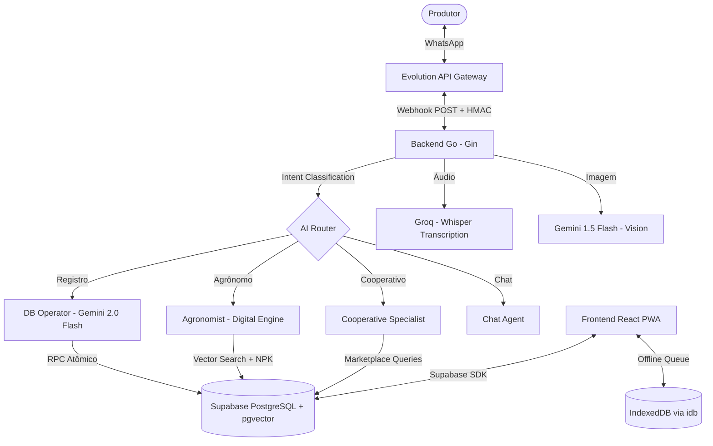
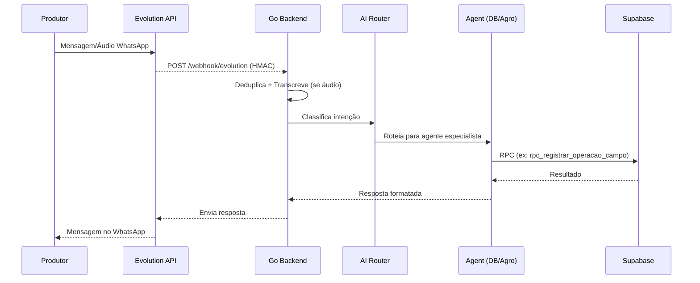

# 🌿 Manejo Orgânico - PMO Bot 🤖


Plataforma de Inteligência Artificial de grau enterprise para automação e gestão do manejo orgânico certificado. O ecossistema integra:

- **Assistente inteligente via WhatsApp:** Processamento multimodal de textos, áudios e imagens para agilidade no campo.
- **Motor de orquestração em Go:** Arquitetura limpa baseada em um Orquestrador central e Handlers modulares por domínio.
- **Dashboard PWA offline-first:** Gestão completa da propriedade, talhões e canteiros com sincronização robusta.
- **Compliance Dinâmico:** Validação rigorosa de insumos baseada em regras atualizáveis via banco de dados (Lei 10.831 e IN 46).

---

## 📌 Índice
1. [Arquitetura](#-arquitetura)
2. [Módulos do Sistema](#-módulos-do-sistema)
3. [Quick Start](#-quick-start)
4. [Variáveis de Ambiente](#-variáveis-de-ambiente)
5. [Referência Técnica](#-referência-técnica)
6. [Segurança](#-segurança)
7. [Licença](#-licença)

---

> [!IMPORTANT]
> **Documentação Técnica Completa**: Mergulhe nos detalhes de arquitetura, fluxos e especificações na nossa [Central de Documentação (SAD)](./docs/README.md).

---

## 📐 Arquitetura

### Visão Geral
O sistema utiliza uma abordagem de **Thin Backend** em Go, delegando a lógica pesada de negócio para RPCs atômicas no banco de dados e a inteligência para um roteador de agentes especializados.


```mermaid
graph TD
    User([Produtor]) <-->|WhatsApp| WPP[Evolution API Gateway]
    WPP <-->|Webhook POST + HMAC| BE[Backend Go - Gin]
    BE -->|Intent Classification| ROUTER{AI Router}
    ROUTER -->|Registro| DB_OP[DB Operator - Gemini 2.0 Flash]
    ROUTER -->|Agrônomo| AGRO[Agronomist - Digital Engine]
    ROUTER -->|Cooperativo| COOP[Cooperative Specialist]
    ROUTER -->|Chat| CHAT[Chat Agent]
    DB_OP -->|RPC Atômico| DB[(Supabase PostgreSQL + pgvector)]
    AGRO -->|Vector Search + NPK| DB
    COOP -->|Marketplace Queries| DB
    BE -->|Áudio| GROQ[Groq - Whisper Transcription]
    BE -->|Imagem| GEMINI_V[Gemini 1.5 Flash - Vision]
    FE[Frontend React PWA] <-->|Supabase SDK| DB
    FE <-->|Offline Queue| IDB[(IndexedDB via idb)]
```

### Fluxo de Mensagem (Sequência)

```mermaid
sequenceDiagram
    participant P as Produtor
    participant W as WPPConnect
    participant W as Evolution API
    participant G as Go Backend
    participant R as AI Router
    participant A as Agent (DB/Agro)
    participant S as Supabase

    P->>W: Mensagem/Áudio WhatsApp
    W-->>G: POST /webhook/evolution (HMAC)
    G->>G: Deduplica + Transcreve (se áudio)
    G->>R: Classifica intenção
    R->>A: Roteia para agente especialista
    A->>S: RPC (ex: rpc_registrar_operacao_campo)
    S-->>A: Resultado
    A-->>G: Resposta formatada
    G-->>W: Envia resposta
    W-->>P: Mensagem no WhatsApp
```

---

## 📦 Módulos do Sistema

### 5.1 Backend Go
O motor principal de orquestração localizado em `pmo-bot-go/`.
- **Arquitetura:** Orquestrador principal (`fsm.go`) com Handlers modulares (Manejo, Financeiro, Limpeza).
- **Entry point:** `cmd/server/main.go`
- **Framework:** Gin (HTTP)
- **Segurança (Guardrails):** Middlewares de LoopGuard e defesas "Deterministic Guardrails" (Fail-safes da FSM) para proteção máxima contra alucinações de LLM e loops infinitos.
- **Infra:** Multi-stage Docker build resultando em imagens de apenas ~20MB.

### 5.2 Frontend PWA
Interface de gestão moderna localizada em `pmo-frontend/`.
- **Stack:** React 18+ com Vite.
- **Mapas (Zero Re-renders):** Integração com **MapLibre GL JS** manipulando `feature-state` diretamente na GPU para performance extrema (evitando re-renders no React). Conta com Guard Clauses no `MapController` para proteção contra coordenadas corrompidas (NaN).
- **UI/UX:** Componentes estilizados com micro-alinhamentos perfeitos na linha de base (`flex items-baseline`) para precisão tipográfica em Dashboards e Perfis.
- **Offline-first:** Sincronização via `useSyncEngine` com persistência em IndexedDB.
- **Resiliência:** Backoff exponencial na fila de sincronização para garantir integridade dos dados.

### 5.3 Database (Supabase)
Persistência e lógica procedural robusta.
- **PostgreSQL:** Tabelas estruturadas para `pmos`, `talhoes`, `canteiros` e `caderno_campo`.
- **pgvector:** Armazenamento de embeddings para o sistema RAG em `knowledge_chunks`.
- **Atomização:** Uso extensivo de RPCs para garantir transações seguras entre múltiplos módulos.

### 5.4 Compliance Engine
O "coração" da certificação orgânica.
- **Blacklist Dinâmica:** Bloqueio automático baseado na tabela `insumos_proibidos` do Supabase com cache thread-safe em Go.
- **Validação de Especificidade:** Exigência de detalhamento para insumos (ex: tipo de esterco).
- **Avisos:** Notificações de precaução baseadas em normas técnicas.

### 5.5 Marketplace B2B2C & Mural de Demandas
Ecossistema de comercialização integrada.
- **Mural de Oportunidades:** Interface para produtores visualizarem e responderem a demandas coletivas de mercado.
- **Torre de Controlo:** Painel administrativo para gestores de cooperativas orquestrarem a oferta e demanda da rede.

### 5.6 Dashboard Analítico Financeiro
Gestão econômica de alta precisão.
- **Performance:** Motor de visualização de performance com DRE (Demonstrativo de Resultados) automatizado.
- **Rentabilidade:** Cálculo de Lucro/Prejuízo granular por Talhão e Canteiro, integrando custos de insumos e mão de obra.

### 5.7 Rastreabilidade Pública (INC 02/2018)
Transparência total do campo à mesa.
- **QR Code Dinâmico:** Geração de etiquetas de rastreabilidade para produtos finais.
- **Página Pública:** Interface mobile-first onde o consumidor consulta a origem, manejo e certificações do lote em tempo real.

### 5.8 Inteligência Artificial (Orquestração & Tooling)
O "cérebro" do ManejoORG.
- **Engenheiro Agrônomo Digital:** O PMO-Bot agora integra RAG (Retrieval-Augmented Generation) com Function Calling para realizar recomendações técnicas e cálculos complexos de adubação (NPK).
- **MCP (Model Context Protocol):** Interação segura de Agentes com o banco de dados via MCP, utilizando transporte `stdio` isolado (ex: `supabase-local`) e injetando tokens localmente para prevenir sobrescritas de sincronização na nuvem.
- **Especialista Cooperativo:** Agente dedicado a mediar negociações no Mural de Demandas e facilitar a logística coletiva.

---

## 🚀 Quick Start

### Pré-requisitos
Go 1.23+ | Node 20+ | Docker 24+ | Docker Compose v2+

### 1. Clonar o Repositório
```bash
git clone https://github.com/thebrunm97/manejo-org.git
cd manejo-org
```

### 2. Configurar o Backend (Orquestrador)
```bash
cd pmo-bot-go
# Copie o env.example se disponível ou use o .env configurado
docker-compose up -d --build
```

### 3. Verificar Saúde do Sistema
```bash
curl http://localhost:8080/health
```

### 4. Configurar o Frontend
```bash
cd pmo-frontend
npm install
npm run dev
```

---

## 🔑 Variáveis de Ambiente

### Backend (`pmo-bot-go`)
| Variável | Descrição | Obrigatório |
| --- | --- | --- |
| `EVOLUTION_API_KEY` | Chave de segurança para o webhook da Evolution API | Sim |
| `EVOLUTION_BASE_URL` | Endpoint da instância da Evolution API | Sim |
| `GROQ_API_KEY` | Chave para transcrição Whisper e extração NER | Sim |
| `GEMINI_API_KEY` | Chave para modelos de orquestração e visão | Sim |
| `SUPABASE_URL` | URL do projeto Supabase | Sim |
| `SUPABASE_KEY` | Anon Key ou Service Role do Supabase | Sim |

### Frontend (`pmo-frontend`)
| Variável | Descrição | Obrigatório |
| --- | --- | --- |
| `VITE_BOT_API_URL` | URL do Backend Go (ex: http://localhost:8080) | Sim |
| `VITE_BOT_API_TOKEN` | Token de autenticação Bearer para o backend | Sim |
| `VITE_WHATSAPP_BOT_NUMBER` | Número de contato do bot oficial | Sim |

---

## 📖 Referência Técnica

### 8.1 Stack de Tecnologias

| Tecnologia | Versão | Aplicação | Observação |
|---|---|---|---|
| **Go (Golang)** | 1.23+ | Backend | Core de processamento e FSM |
| **React** | 19.1+ | Frontend | Interface PWA moderna |
| **MapLibre GL JS** | 5.21.x | Frontend (Mapas) | Engine WebGL open-source (sem custos de API) |
| **Esri World Imagery** | - | Frontend (Tiles) | Satélite de alta qualidade via ArcGIS REST |
| **Turf.js** | - | Frontend + Cálculos | Geometria GeoJSON e cálculos espaciais |
| **Supabase** | - | Database | PostgreSQL + pgvector + Auth |
| **Gemini 2.0 Flash** | - | IA Engine | Orquestração e Visão Computacional |
| **Open-Meteo (ECMWF)** | - | Weather Source | Previsão rural de alta precisão sem API Key |

### 8.2 Endpoints HTTP
| Método | Rota | Descrição |
| --- | --- | --- |
| `GET` | `/health` | Healthcheck de integridade do container |
| `POST` | `/webhook/evolution` | Endpoint principal para mensagens do WhatsApp |
| `POST` | `/webhook/knowledge` | Upload e ingestão de documentos para o RAG |

### 8.2 RPCs Supabase (Principais)
| RPC | Descrição |
| --- | --- |
| `rpc_registrar_operacao_campo` | Operação atômica que registra atividade e alimenta o Caderno de Campo |
| `criar_infraestrutura_pmo` | Criação facilitada de talhões e canteiros via interface bot |
| `match_farm_documents` | Busca semântica vetorial por similaridade de cosseno |

---

## 🔒 Segurança
- **HMAC Validation:** Assinatura de payloads nos webhooks para evitar requisições forjadas.
- **LoopGuard:** Proteção no nível da aplicação contra loops infinitos de ferramentas de IA.
- **RLS (Row Level Security):** Políticas granulares no banco de dados para isolamento de usuários/PMOs.
- **Attack Surface:** Imagens Docker minimalistas e isolamento de rede interna.

---

## 📄 Licença
Este projeto é de uso restrito e privado. Todos os direitos reservados para **ManejoORG**.

---
**Desenvolvido com 💚 para o futuro da agricultura orgânica.**
