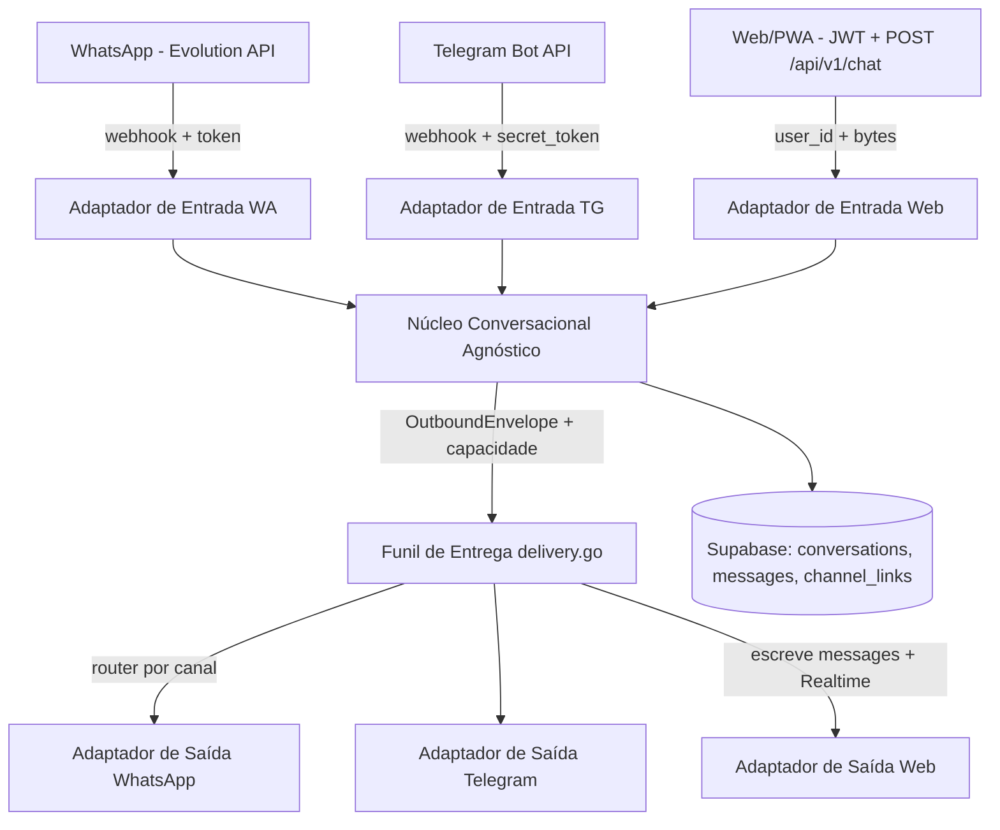

# FEATURE multicanal — WhatsApp, Telegram e Chat Web/PWA

> **Status:** Planejamento inicial — documento vivo, em construção.
> **Branch:** `feature-multicanal`
> **Última atualização:** 06/09/2026

---

## 1. Visão Geral

Hoje o assistente do ManejoORG conversa **exclusivamente via WhatsApp**. O objetivo
desta feature é transformar o **núcleo conversacional em algo agnóstico de
transporte**, permitindo que o mesmo motor de IA, guardrails e ferramentas atenda:

| Canal | Estado atual | Tipo de integração |
|---|---|---|
| **WhatsApp** | ✅ Em produção | Evolution API (webhook + envio) |
| **Telegram** | ⚠️ Parcial — só alertas de operação (`internal/notify/telegram.go`), não conversacional | Bot API (webhook/getUpdates) |
| **Chat Web/PWA** | ⬜ Não existe para o produtor (só monitor admin) | Supabase Realtime + JWT |

Decisão arquitetural de referência: **ADR-011** (Abstração de canal de chat —
WhatsApp e app como adaptadores de um núcleo único). Este documento é o
desdobramento operacional dessa decisão, estendendo-a ao Telegram.

Regra de ouro: **lógica de negócio e guardrails ficam num único ponto de
verdade.** Um "segundo bot dentro do app" ou um bot Telegram paralelo duplicaria
blacklist de insumos, HITL e auditoria até divergir — exatamente o que o
ADR-009/ADR-011 alerta.

---

## 2. Estado Atual (Mapeamento do Acoplamento)

O sistema é WhatsApp-centric em toda a superfície **fora** do núcleo FSM/IA:

### 2.1 Identidade = telefone
- `ports.IncomingMessage.From` é tratado como telefone em todo o pipeline.
- `ResolvePhone` (`pmo-bot-go/internal/supabase/client.go:483`) só resolve LIDs de
  WhatsApp; chat do Telegram (int `chat_id` sem DDI) **colide** com telefones BR de
  10 dígitos; chat web usa `user_id` (UUID) — tipos incompatíveis no mesmo campo.
- Sessão/mutex (`internal/state/fsm.go:50`, `sessionMu`), histórico
  (`internal/history/manager.go`), `messages.phone`, HITL, idempotência de tool e
  `profiles.telefone` são todos keyed em telefone.

### 2.2 Saída acoplada à Evolution
- `ports.MessageSender` (`internal/ports/whatsapp.go:9`) vaza conceitos de
  WhatsApp: `sendVoice(..., isPtt)`, presença "composing", `SendButton` no formato
  Baileys, `DownloadAudio(messageID, rawPayload)`.
- ~30 chamadas diretas à porta em `state/` e `webhook/` contornam a única camada de
  entrega (`internal/queue/delivery.go`).
- Telegram não tem "presence" (usa `sendChatAction`); web tem streaming — o núcleo
  não pode nivelar por baixo nem mandar card React para o WhatsApp.

### 2.3 Entrada única de webhook
- `webhook/handler.go:150-155` roteia `/webhook`, `/webhook/evolution` e
  `/api/:session/webhook`, todos parseados por `evolution.ParseWebhook`
  (`adapter/evolution/adapter.go:685`), com `token` query param.
- Telegram: formato de Update diferente, `secret_token` no header, `chat_id` na
  própria mensagem. Web: JWT do Supabase já autentica — 3 modelos de auth no mesmo
  servidor.
- Dedup e auditoria são por `msgID` com `source` fixo
  `"whatsapp_evolution"` (`handler.go:286`) — IDs de canais diferentes podem
  colidir (precisa namespace por canal).

### 2.4 Estado/sessão efêmero
- `history.Manager` é `map[phone]*Conversation` **em memória**, com TTL de 45 min e
  **reinicia a cada deploy** (DT-58). Mudar de canal no meio de uma entrevista FSM
  perde o contexto.

### 2.5 Ativos já prontos (não recomeçar do zero)
- `ports.Synthesizer` (TTS) e `ResolveResponseModeFor` já são agnósticos de canal.
- `LiveChatMonitor.tsx` já assina **Supabase Realtime** sobre `messages` — o
  transporte do chat web já roda em produção.
- Gateway web já resolve identidade por **JWT** (`internal/middleware/auth.go`,
  `ContextUserID` = `auth.users.id`).
- `domain.ProcessAudioMessage` já aceita **bytes crus** (assinatura certa para
  upload de app) — está desligada com `TODO(fase-5-ou-switchover)`.
- ADR-011, `docs/plans/PLAN-adr-011-chat-abstraction.md` e
  `pmo-frontend/docs/specs/future_spike_in_app_bot.md` já desenham boa parte da
  direção.

---

## 3. Decisões Adotadas (base)

Herdadas do **ADR-011** (Status: Proposto) e **ADR-010** (multitenancy por
organização):

1. **Identidade canônica = `user_id`** (`auth.users.id`). Telefone vira *um*
   identificador de canal entre outros, numa tabela de vínculo canal↔usuário. O
   fallback `ilike` dos últimos 8 dígitos não sobrevive.
2. **Conversa/sessão vira entidade de primeira classe, persistida** (`conversations`:
   `id`, `user_id`, `pmo_id`, `channel`) e `messages` migra para `conversation_id`.
3. **Tenant ativo viaja na sessão, não em `profiles`** — evita vazamento de
   contexto entre canais.
4. **Capacidades declaradas por canal** (envelope de saída tipado) — streaming/pode
   web, botões inline do Telegram, PTT do WhatsApp.
5. **Mídia de entrada aceita bytes diretamente** (`domain.ProcessAudioMessage` ligada
   como caminho único).
6. **Transporte do chat web = Supabase Realtime** sobre `messages` reformulada, com
   RLS que permita ao dono ler o próprio histórico.
7. **Funil de saída único** (`queue/delivery.go`) roteia para o adaptador correto
   pelo canal da conversa.

---

## 4. Desafios por Canal

### 4.1 Chat Web/PWA (primeiro — menor esforço)
- **Maior**: identidade. Já resolvida no gateway por JWT; falta conectar o pipeline
  do bot (que hoje nunca vê JWT) a esse `user_id`.
- Envio do produtor: `POST /api/v1/chat` autenticado (com bytes p/ áudio/imagem).
- Entrega: escrever a resposta em `messages` → Realtime entrega ao frontend sem
  WebSocket próprio.
- RLS: hoje "Admins acessam mensagens" — produtor **não lê o próprio histórico**.
- UI de chat não existe para o produtor (só `LiveChatMonitor` admin).
- Pausar bot / HITL no web (o admin pausa por `phone`, precisa virar por conversa).

### 4.2 Telegram (segundo)
- **Identidade**: `chat_id` (~9-10 dígitos, sem DDI) colide com telefones BR —
  exige separação total `(channel, sender_id)` e vínculo canal↔usuário robusto.
- **Inbound**: webhook próprio (`/webhook/telegram` + `secret_token`), parser de
  `Update` (message/edited_message/callback_query), ordem de delivery
  (`offset`/`getUpdates` vs webhook) e filtro de `chat_id` autorizado.
- **Botões**: inline keyboards → mapear para o `SendButton` genérico existente.
- **Presença/typing**: `sendChatAction` (typing/recording_voice) — diferente do
  WhatsApp "composing".
- **Áudio**: upload na Bot API (`sendAudio`/`sendVoice`) vs. multipart da Evolution.
- **Rate limit próprio do Telegram** (30 msg/s por bot) — hoje o limiter é keyed por
  `From` com thresholds pensados para WhatsApp.
- **Proatividade** (automações agendadas do roadmap): escolher o canal de entrega.

### 4.3 WhatsApp (manter funcionando sem regressão)
- Migração de identidade toca ~20 pontos (perfil, FSM, mutex, idempotência,
  auditoria, RLS) — risco de regressão no canal que está em produção.
- `IsFromMe`/`IsBroadcast` são conceitos só do WhatsApp e devem parar de vazar
  para o núcleo.
- Strings de copy hardcoded para WhatsApp (`onboarding.go`, `media_worker.go`,
  `proactivity/worker.go`) parametrizam por canal.

---

## 5. Esboço de Arquitetura-Alvo

Princípio: **adaptadores conhecem o canal; o núcleo conhece conversas.**

---

## 6. Sequência de Implementação Planejada (rascunho inicial)

> Fases mentem até serem refinadas — dados concretos serão coletados ao executar.

- [ ] **Fase A — Fundação de dados**: tabelas `conversations`, vínculo
  canal↔usuário, migração de `messages` (`conversation_id`, `user_id`, `canal`),
  RLS do dono. Uniqueness de dedup `(source, msg_id)`.
- [ ] **Fase B — Núcleo agnóstico**: identidade `user_id` + tenant na sessão;
  `OutboundEnvelope` + capacidades; funil de entrega único; mídia por bytes.
- [ ] **Fase C — Chat Web/PWA**: adaptador de entrada/saída web, endpoint autenticado
  + UI de chat com Realtime; HITL por conversa.
- [ ] **Fase D — Telegram**: adaptador de entrada/saída, vínculo de identidade,
  botões inline, áudio, rate limits e proatividade.
- [ ] **Fase E — Estabilização/regressão WhatsApp**: limpeza dos ~30 call sites,
  copy parametrizada, teletria por canal, testes E2E dos três canais.

---

## 7. Critérios de Sucesso (initial draft)

- [ ] Mesmo produtor conversa com o assistente pelo WhatsApp e pelo app, com
      histórico persistido e **sem vazamento de tenant entre canais**.
- [ ] Um `Telegram chat_id` jamais colide com um `telefone` de outro produtor.
- [ ] Nenhuma chamada direta à porta do WhatsApp fora dos adaptadores.
- [ ] A resposta sai sempre **pelo mesmo canal** que originou a mensagem.
- [ ] Telegram aprende DRAW: responder com botões inline funciona e degrada para
      texto se o canal não suportar.

---

## 8. Riscos e Frentes em Aberto

- **Dependência do ADR-010**: identidade/tenant por organização; o desenho de sessão
  pressupõe a decisão.
- **Grau de persistência da conversa**: compartilhar histórico entre canais
  (mesmo perfil) ou segmentar por canal — decisão de produto ainda não tomada.
- **Quota**: definir se é por usuário (atual) ou por canal.
- **Telemetria**: labels fixos `"evolution"` em `webhook/handler.go` precisam de
  dimensão de canal.
- **Proatividade/automações agendadas**: hoje enviam pelo WhatsApp; com multichannel,
  precisa de política de canal de entrega.

---

## 9. Referências

- [ADR-011 — Abstração de Canal de Chat](./architecture/adr/011-abstracao-de-canal-de-chat.md)
- [ADR-010 — Multitenancy por Organização](./architecture/adr/010-multitenancy-por-organizacao.md)
- [Plan de implementação conversacional](./plans/PLAN-adr-011-chat-abstraction.md)
- [`pmo-bot-go/docs/plans/WHATSAPP_REFACTOR_PLAN.md`](../pmo-bot-go/docs/plans/WHATSAPP_REFACTOR_PLAN.md)
- [`pmo-frontend/docs/specs/future_spike_in_app_bot.md`](../pmo-frontend/docs/specs/future_spike_in_app_bot.md)
- [`pmo-bot-go/docs/debitos_tecnicos.md`](../pmo-bot-go/docs/debitos_tecnicos.md) (DT-58 — sessão efêmera)