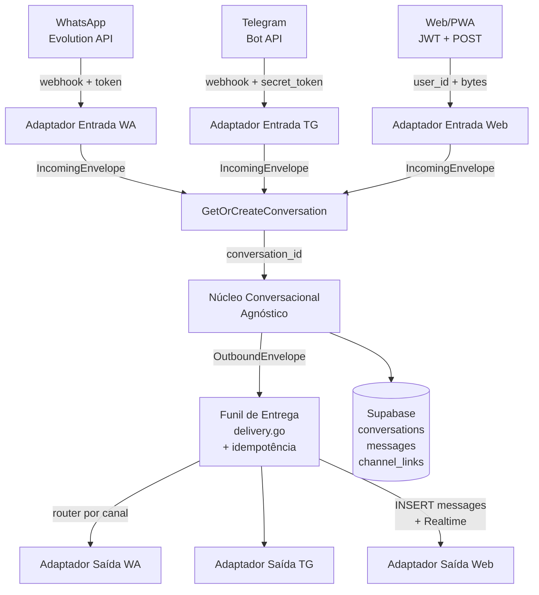

# PLAN — Feature Multicanal (WhatsApp + Telegram + Chat Web/PWA)

> **Branch:** `feature-multicanal`
> **Base:** `fix/bigpickle-bugfix-loop`
> **Criado em:** 06/09/2026
> **Última atualização:** 06/09/2026
> **Status:** ✅ Aprovado — aguardando início de implementação

---

## 1. Visão Geral

Transformar o motor conversacional de **WhatsApp-centric** para **agnóstico de canal**, permitindo que o mesmo núcleo de IA, guardrails, HITL e ferramentas atenda três canais: WhatsApp (Evolution API), Telegram (Bot API) e Chat Web/PWA (Supabase Realtime + JWT).

### Decisões de Produto Aprovadas

| Decisão | Definição |
|---------|-----------|
| **Histórico** | Unificado por `(tenant_id, user_id)`, independente do canal. Cada mensagem carrega `channel` (enum) e `channel_message_id`. |
| **Quota** | Global por `(tenant_id, user_id)`. Canais possuem apenas "pesos" configuráveis (ex: WhatsApp custo maior), mas a conta é global. |
| **Identidade canônica** | `user_id` (UUID de `auth.users`). Telefone, `chat_id` e `user_id` web são identificadores de canal vinculados via `channel_links`. |
| **Mídia** | Backend normaliza para URLs de CDN/Storage + metadados (`mime_type`, `size`, `thumb_url`). Signed URLs para mídias sem URL direta. |

---

## 2. Escopo e Não-Escopo

### Escopo

- Tabelas `conversations`, `channel_links`; migração de `messages`
- Identidade centrada em `user_id` (desacoplamento de telefone)
- `OutboundEnvelope` tipado com capacidades por canal
- Funil de entrega único (`delivery.go`) com roteamento por canal e idempotência
- Adaptadores de entrada/saída para WhatsApp, Telegram e Web
- UI de chat no frontend (produtor) com badge de canal de origem
- RLS por `(tenant_id, user_id)` — não por canal — incluindo INSERT e admin/HITL
- Quota global com pesos por canal (defaults configuráveis)
- HITL por `conversation_id` (não por `phone`)
- Lifecycle de conversas (criação automática, reabertura, `updated_at`)

### Não-Escopo (para decisões futuras)

- Proatividade multi-canal (escolha automática do canal de entrega)
- Chatbot no app mobile nativo (React Native) — apenas PWA por agora
- Migração de dados históricos sem `user_id` resolvível (ficam com campos nulos)
- Grupos de WhatsApp ou canais de Telegram

---

## 3. Mapeamento do Acoplamento Atual (Baseline)

### 3.1 Call Sites Diretos ao `MessageSender` (~35 pontos)

| Pacote | Arquivo | Nº de chamadas | Métodos |
|--------|---------|---------------:|---------|
| `state` | `fsm.go` | 4 | `SendMessage`, `DownloadAudio`, `DownloadImage` |
| `state` | `utils.go` | 2 | `SendMessage`, `SendVoice` |
| `state` | `onboarding.go` | 1 | `SendButton` |
| `state` | `response_preference_command.go` | 2 | `SendMessage` |
| `state` | `orchestrator.go` | 2 | `SendPresence` |
| `state` | `tool_pipeline.go` | 1 | `SendButton` |
| `webhook` | `handler.go` | 12 | `SendMessage`, `SetPresence` |
| `queue` | `delivery.go` | 2 | `SendMessage`, `SendVoice` |
| `queue` | `ai_worker.go` | 3 | `SendMessage`, `SetPresence` |
| `queue` | `media_worker.go` | 4 | `SendMessage`, `SendPresence`, `DownloadAudio`, `DownloadImage` |
| `proactivity` | `worker.go` | 1 | `SendMessage` |
| `jobs` | `plantio.go` | 1 | `SendMessage` |
| `api` | `chat_admin.go` | 1 | `SendMessage` |

### 3.2 Chave de Identidade

- `history.Manager`: `map[string]*Conversation` keyed por `phone`
- `state.sessionMu`: `sync.Map` keyed por `phone`
- `webhook.processedMu`: dedup por `msgID` com `source` fixo `"whatsapp_evolution"`
- `InsertMessage`: campo `Phone` obrigatório
- `IsBotPaused`: checa por `phone`
- `GetProfileByPhone`: perfil por telefone
- `ResolvePhone`: LID → telefone (WhatsApp-only)

---

## 4. Arquitetura-Alvo



**Princípio:** Adaptadores conhecem o canal; o núcleo conhece conversas.

---

## 5. Modelo de Dados (Fase A)

### 5.1 Novas Tabelas

```sql
-- Enum de canais
CREATE TYPE channel_type AS ENUM ('whatsapp', 'telegram', 'web');

-- Conversas unificadas por usuário/tenant
CREATE TABLE conversations (
    id          UUID PRIMARY KEY DEFAULT gen_random_uuid(),
    tenant_id   UUID REFERENCES tenants(id),        -- nullable até ADR-010 fechar
    user_id     UUID NOT NULL REFERENCES auth.users(id),
    status      TEXT NOT NULL DEFAULT 'active',      -- active | archived
    created_at  TIMESTAMPTZ DEFAULT now(),
    updated_at  TIMESTAMPTZ DEFAULT now(),
    UNIQUE(tenant_id, user_id)
);

-- Trigger para manter updated_at sincronizado.
-- NOTA: só dispara para mensagens com conversation_id preenchido (pós-backfill).
-- Mensagens antigas inseridas antes da migração (conversation_id IS NULL) não
-- ativam o trigger, o que é comportamento esperado e aceitável.
CREATE OR REPLACE FUNCTION update_conversation_timestamp()
RETURNS TRIGGER AS $$
BEGIN
    UPDATE conversations SET updated_at = now()
    WHERE id = NEW.conversation_id;
    RETURN NEW;
END;
$$ LANGUAGE plpgsql;

CREATE TRIGGER trg_messages_update_conversation
AFTER INSERT ON messages
FOR EACH ROW
WHEN (NEW.conversation_id IS NOT NULL)
EXECUTE FUNCTION update_conversation_timestamp();

-- Vinculação canal ↔ usuário (1 user pode ter N canais)
CREATE TABLE channel_links (
    id              UUID PRIMARY KEY DEFAULT gen_random_uuid(),
    user_id         UUID NOT NULL REFERENCES auth.users(id),
    channel         channel_type NOT NULL,
    channel_user_id TEXT NOT NULL,        -- telefone, chat_id, user_id web
    metadata        JSONB DEFAULT '{}',
    verified_at     TIMESTAMPTZ,
    created_at      TIMESTAMPTZ DEFAULT now(),
    UNIQUE(channel, channel_user_id)      -- um sender_id por canal é de um único user
);

-- Índice de resolução reversa: dado um user_id, listar seus canais vinculados
CREATE INDEX idx_channel_links_user_channel 
    ON channel_links(user_id, channel);
```

### 5.2 Migração de `messages`

**Estratégia gradual:** colunas novas são **nullable** na migração inicial. Só serão tornadas `NOT NULL` após o backfill validar zero órfãos (tarefa A.5b).

```sql
-- Passo 1: adicionar colunas nullable
ALTER TABLE messages
    ADD COLUMN conversation_id UUID REFERENCES conversations(id),
    ADD COLUMN channel         channel_type DEFAULT 'whatsapp',
    ADD COLUMN channel_msg_id  TEXT,
    ADD COLUMN user_id         UUID REFERENCES auth.users(id);

-- Dedup namespace por canal (substitui msgID global)
-- Só vale para mensagens pós-migração (channel_msg_id NOT NULL)
CREATE UNIQUE INDEX idx_messages_dedup 
    ON messages(channel, channel_msg_id) 
    WHERE channel_msg_id IS NOT NULL;

-- Passo 2 (após backfill validado — tarefa A.5b):
-- ALTER TABLE messages ALTER COLUMN conversation_id SET NOT NULL;
-- ALTER TABLE messages ALTER COLUMN user_id SET NOT NULL;
```

### 5.3 Backfill Strategy

```sql
-- 1. Derivar user_id a partir de phone via profiles
UPDATE messages m
SET user_id = p.user_id
FROM profiles p
WHERE m.phone = p.telefone
  AND m.user_id IS NULL;

-- 2. Criar conversations para cada (tenant_id, user_id) distinto
INSERT INTO conversations (tenant_id, user_id)
SELECT DISTINCT p.tenant_id, m.user_id
FROM messages m
JOIN profiles p ON p.user_id = m.user_id
WHERE m.user_id IS NOT NULL
ON CONFLICT (tenant_id, user_id) DO NOTHING;

-- 3. Popular conversation_id em messages
UPDATE messages m
SET conversation_id = c.id
FROM conversations c
WHERE m.user_id = c.user_id
  AND m.conversation_id IS NULL;

-- 4. Setar channel = 'whatsapp' para todas as existentes
UPDATE messages SET channel = 'whatsapp' WHERE channel IS NULL;

-- 5. Validar zero órfãos antes de tornar NOT NULL
-- SELECT COUNT(*) FROM messages WHERE conversation_id IS NULL; → deve ser 0
-- SELECT COUNT(*) FROM messages WHERE user_id IS NULL;
--   → registros sem perfil resolvível ficam nulos (excluídos do NOT NULL constraint)
```

Mensagens antigas sem `channel_msg_id` confiável ficam com o campo nulo. O dedup por `(channel, channel_msg_id)` só se aplica a mensagens pós-migração.

### 5.4 RLS (Completo)

```sql
-- ─── Conversations ───────────────────────────────────────

-- Produtor: lê/altera as próprias conversas
CREATE POLICY conversations_owner ON conversations
    FOR ALL USING (user_id = auth.uid());

-- Admin: acessa conversas do tenant (por role)
CREATE POLICY conversations_admin ON conversations
    FOR ALL USING (
        EXISTS (
            SELECT 1 FROM profiles
            WHERE profiles.user_id = auth.uid()
              AND profiles.role = 'admin'
              AND profiles.tenant_id = conversations.tenant_id
        )
    );

-- ─── Messages ────────────────────────────────────────────

-- Produtor: lê mensagens das próprias conversas
CREATE POLICY messages_owner_select ON messages
    FOR SELECT USING (
        conversation_id IN (
            SELECT id FROM conversations WHERE user_id = auth.uid()
        )
    );

-- Produtor: insere mensagens nas próprias conversas
CREATE POLICY messages_owner_insert ON messages
    FOR INSERT WITH CHECK (
        conversation_id IN (
            SELECT id FROM conversations WHERE user_id = auth.uid()
        )
    );

-- Admin/HITL: lê e escreve em conversas do tenant
CREATE POLICY messages_admin ON messages
    FOR ALL USING (
        conversation_id IN (
            SELECT id FROM conversations c
            WHERE EXISTS (
                SELECT 1 FROM profiles
                WHERE profiles.user_id = auth.uid()
                  AND profiles.role = 'admin'
                  AND profiles.tenant_id = c.tenant_id
            )
        )
    );
```

### 5.5 Conversation Lifecycle

| Evento | Ação |
|--------|------|
| Primeira mensagem de qualquer canal para `(tenant_id, user_id)` sem conversa | `INSERT INTO conversations` |
| Mensagem para `(tenant_id, user_id)` com conversa `status='archived'` | `UPDATE conversations SET status='active', updated_at=now()` |
| Cada INSERT em `messages` com `conversation_id` preenchido | Trigger `trg_messages_update_conversation` atualiza `updated_at` |
| Admin arquiva conversa | `UPDATE conversations SET status='archived'` |

Toda essa lógica fica centralizada na função `GetOrCreateConversation(tenant_id, user_id)` (tarefa B.11).

---

## 6. Fases de Implementação

### Fase A — Fundação de Dados

| Task ID | Tarefa | Agente | Arquivos Impactados | INPUT → OUTPUT → VERIFY |
|---------|--------|--------|---------------------|-------------------------|
| A.1 | Criar enum `channel_type` e tabelas `conversations`, `channel_links` com índices | `database-architect` | `supabase/migrations/` | DDL → Tabelas criadas → `\d conversations`, `\di idx_channel_links_user_channel` |
| A.2 | Criar trigger `trg_messages_update_conversation` | `database-architect` | `supabase/migrations/` | Trigger → Funcional → INSERT em messages atualiza `updated_at` da conversa |
| A.3 | Migrar `messages`: adicionar `conversation_id`, `channel`, `channel_msg_id`, `user_id` (**nullable**) | `database-architect` | `supabase/migrations/` | ALTER → Colunas existem → Query de teste |
| A.4 | Criar índice de dedup `(channel, channel_msg_id)` parcial | `database-architect` | `supabase/migrations/` | CREATE INDEX → Index existe → `\di idx_messages_dedup` |
| A.5a | Backfill: derivar `user_id` de `phone` via `profiles`, criar `conversations`, popular `conversation_id` | `database-architect` | `supabase/migrations/` ou script | UPDATE → Registros populados → `COUNT(*) WHERE conversation_id IS NULL` |
| A.5b | Validar backfill e tornar `conversation_id`/`user_id` NOT NULL (se zero órfãos) | `database-architect` | `supabase/migrations/` | ALTER NOT NULL → Colunas obrigatórias → `\d messages` |
| A.6 | Políticas RLS completas: `conversations_owner`, `conversations_admin`, `messages_owner_select`, `messages_owner_insert`, `messages_admin` | `database-architect` + `security-auditor` | `supabase/migrations/` | CREATE POLICY → Policies ativas → Teste com JWT produtor + admin |

**Dependências:** A.1 → A.2 → A.3 → A.4. A.5a após A.3. A.5b após A.5a validado. A.6 após A.3 (precisa das colunas novas em `messages` para testar INSERT/SELECT com RLS).

---

### Fase B — Núcleo Agnóstico

| Task ID | Tarefa | Agente | Arquivos Impactados | INPUT → OUTPUT → VERIFY |
|---------|--------|--------|---------------------|-------------------------|
| B.1 | Criar `IncomingEnvelope` e `OutboundEnvelope` com capacidades tipadas por canal | `backend-specialist` | `internal/ports/channel.go` [NEW] | Types → Compila → `go vet` |
| B.2 | Refatorar `IncomingMessage`: incluir `Channel`, `UserID`, `ConversationID`; mover `IsFromMe`/`IsBroadcast` para adaptador WA | `backend-specialist` | `internal/ports/whatsapp.go` | Campos alterados → Testes existentes passam → `go test ./internal/ports/...` |
| B.3 | Criar `ChannelSender` interface (substituir `MessageSender`) com métodos agnósticos | `backend-specialist` | `internal/ports/channel.go` | Interface → Compila → Adapters implementam |
| B.4 | `ResolveIdentity`: nova função que resolve `(channel, sender_id)` → `(user_id, tenant_id)` via `channel_links` | `backend-specialist` | `internal/supabase/identity.go` [NEW] | Função → Testes unitários → `go test` |
| B.5 | Refatorar `history.Manager`: chave de `phone` para `conversation_id` (UUID) | `backend-specialist` | `internal/history/manager.go` | Chave alterada → Testes adaptados → `go test ./internal/history/...` |
| B.6 | Refatorar `sessionMu`: chave de `phone` para `user_id` | `backend-specialist` | `internal/state/fsm.go` | Chave alterada → Testes passam → `go test ./internal/state/...` |
| B.7 | Funil de entrega: `delivery.go` recebe `OutboundEnvelope` e roteia para adaptador correto, com idempotência | `backend-specialist` | `internal/queue/delivery.go` | Roteamento → Testes com mock de 3 canais → `go test` |
| B.8 | Dedup: namespace por `(channel, msg_id)` em vez de `msgID` global | `backend-specialist` | `internal/webhook/handler.go` | Namespace → Dedup funciona por canal → Teste unitário |
| B.9 | HITL: `IsBotPaused` recebe `conversation_id` em vez de `phone` | `backend-specialist` | `internal/supabase/client.go`, `webhook/handler.go` | Assinatura alterada → Pausa por conversa funciona → Teste |
| B.10 | Quota global: middleware keyed por `(tenant_id, user_id)`, pesos aplicados antes do contador | `backend-specialist` | `internal/ports/ratelimit.go` | Peso configurável → Testes → `go test` |
| B.11 | Implementar `GetOrCreateConversation(tenant_id, user_id)` centralizado, usado por todos os adaptadores de entrada para criar/reativar conversas | `backend-specialist` | `internal/supabase/conversation.go` [NEW] | Função → Testes unitários (create + reopen + archived→active) → `go test` |

**Dependências:** B.1 → B.2+B.3 (paralelo). B.4 e B.11 após A.1. B.5+B.6 paralelos. B.7 após B.3. B.8+B.9+B.10 paralelos após B.4. B.11 independente (usado por todos os adaptadores de entrada).

---

### Fase C — Chat Web/PWA

| Task ID | Tarefa | Agente | Arquivos Impactados | INPUT → OUTPUT → VERIFY |
|---------|--------|--------|---------------------|-------------------------|
| C.1 | Adaptador de entrada web: `POST /api/v1/chat` autenticado por JWT; chama `GetOrCreateConversation` | `backend-specialist` | `internal/api/chat_web.go` [NEW] | Endpoint → 200 com JWT válido, 401 sem → `curl` tests |
| C.2 | Adaptador de saída web: INSERT em `messages` → Supabase Realtime entrega | `backend-specialist` | `internal/adapter/web/sender.go` [NEW] | Sender implementa `ChannelSender` → Teste unitário |
| C.3 | Mídia web: upload multipart → Storage + metadados normalizados (CDN URL, `mime_type`, `size`, `thumb_url`) | `backend-specialist` | `internal/adapter/web/media.go` [NEW] | Upload → URL gerada → Signed URL acessível |
| C.4 | UI de chat (produtor): componente React com Realtime subscription e badge de canal de origem | `frontend-specialist` | `pmo-frontend/src/components/Chat/` [NEW] | Componente → Renderiza mensagens com badges → Visual review |
| C.5 | Renderização de mídia cross-channel: com base em metadados normalizados (não assume URL do WA) | `frontend-specialist` | `pmo-frontend/src/components/Chat/MessageBubble.tsx` [NEW] | Mídia de WA/TG renderiza no Web → Teste visual |
| C.6 | RLS: ajustar para INSERT + SELECT do produtor (policies A.6) funcionarem no fluxo web | `database-architect` + `security-auditor` | `supabase/migrations/` | Policy → Produtor insere e lê → Teste com JWT |

**Dependências:** C.1+C.2 após B.7+B.11. C.3 após C.1. C.4 paralelo a C.1 (mock data). C.5 após C.4. C.6 após A.6.

---

### Fase D — Telegram

| Task ID | Tarefa | Agente | Arquivos Impactados | INPUT → OUTPUT → VERIFY |
|---------|--------|--------|---------------------|-------------------------|
| D.1 | Adaptador de entrada TG: webhook `/webhook/telegram` + `secret_token` header; chama `GetOrCreateConversation` | `backend-specialist` | `internal/adapter/telegram/inbound.go` [NEW] | Webhook registrado → Recebe Updates → Teste com payload mock |
| D.2 | Parser de `Update` (message, edited_message, callback_query) → `IncomingEnvelope` | `backend-specialist` | `internal/adapter/telegram/parser.go` [NEW] | Parser → Converte corretamente → Testes unitários |
| D.3 | Adaptador de saída TG: `sendMessage`, `sendVoice`, `sendChatAction`, inline keyboards | `backend-specialist` | `internal/adapter/telegram/sender.go` [NEW] | Sender implementa `ChannelSender` → Teste unitário |
| D.4 | Mapeamento `SendButton` → inline keyboard do Telegram; degradação para texto se canal não suportar | `backend-specialist` | `internal/adapter/telegram/sender.go` | Botões → Inline keyboard → Teste |
| D.5 | Onboarding Telegram: fluxo `/start` com deeplink token | `backend-specialist` | `internal/adapter/telegram/onboarding.go` [NEW] | Ver fluxo detalhado abaixo |
| D.6 | Rate limiter Telegram-aware: respeitar 30 msg/s por bot global | `backend-specialist` | `internal/adapter/telegram/limiter.go` [NEW] | Limiter → Teste de stress → `go test -race` |

#### D.5 — Fluxo de Onboarding Telegram (Detalhado)

```
1. Produtor acessa link no Web/PWA: "Vincular Telegram"
2. Backend gera token curto (ex: 6 chars, TTL 10min) e armazena em channel_links_pending
3. URL gerada: t.me/<bot_username>?start=<token>
4. Produtor clica no link → abre Telegram → envia /start <token>
5. Adaptador TG recebe Update com /start <token>
6. Backend resolve token → obtém user_id → INSERT channel_links(user_id, 'telegram', chat_id)
7. Bot responde no Telegram: "✅ Conta vinculada com sucesso!"
8. channel_links_pending deletado
```

**Dependências:** D.1+D.2+D.3 paralelos. D.4 após D.3. D.5 após B.4+B.11. D.6 paralelo.

---

### Fase E — Estabilização e Regressão WhatsApp

| Task ID | Tarefa | Agente | Arquivos Impactados | INPUT → OUTPUT → VERIFY |
|---------|--------|--------|---------------------|-------------------------|
| E.1 | Substituir ~35 chamadas diretas a `MessageSender` por passagem via `OutboundEnvelope` + funil | `backend-specialist` | `state/`, `webhook/`, `queue/`, `proactivity/`, `jobs/`, `api/` | Chamadas → Via funil → `grep` retorna só adaptadores |
| E.2 | Remover `IsFromMe` e `IsBroadcast` do `IncomingMessage` (filtro fica no adaptador WA) | `backend-specialist` | `ports/whatsapp.go`, `webhook/handler.go` | Campos removidos → Compila → `go build` |
| E.3 | Parametrizar strings de copy por canal (mapa `channel → templates`) | `backend-specialist` | `state/onboarding.go`, `queue/media_worker.go`, `proactivity/worker.go` | Templates → Mensagens adaptadas por canal → Teste unitário |
| E.4 | Telemetria: dimensão `channel` nos labels do Prometheus | `backend-specialist` | `internal/telemetry/`, `webhook/handler.go` | Labels → Métricas com `channel=whatsapp|telegram|web` → Prometheus query |
| E.5 | Auditoria: confirmar que nenhuma rota nova usa `channel` como chave de identidade ou quota | `security-auditor` | Todos | Audit → Relatório → Zero violações |
| E.6 | Testes E2E: cenários cross-channel (ver seção 10) | `test-engineer` | `internal/test/` | Testes → Todos passam → `go test -tags=e2e` |

**Dependências:** E.1 após B.7. E.2 após B.2. E.3+E.4 paralelos. E.5 após E.1. E.6 último.

---

## 7. Funil de Entrega — Idempotência

Retries no funil de entrega não devem duplicar mensagens no canal de destino.

| Canal | Chave de idempotência | Fonte |
|-------|----------------------|-------|
| **WhatsApp** | `channel_msg_id` retornado pela Evolution API após envio | Adaptador de saída WA |
| **Telegram** | `message_id` retornado pela Bot API após envio | Adaptador de saída TG |
| **Web** | UUID gerado pelo núcleo (`gen_random_uuid()` no INSERT) | Adaptador de saída Web (Supabase INSERT idempotente por PK) |

Para canais onde o `channel_msg_id` só é conhecido **após** o envio (WhatsApp, Telegram), o funil usa um fluxo de duas fases:

1. **Antes de enviar:** gera um `idempotency_key` local: `SHA256(conversation_id + payload_hash + channel)`
2. **Grava o `idempotency_key`** em `messages.channel_msg_id` (INSERT da mensagem de saída com status `sending`)
3. **Verifica duplicata:** se o `idempotency_key` já existir em `messages.channel_msg_id`, aborta o envio (retry detectado)
4. **Após envio com sucesso:** atualiza `messages.channel_msg_id` com o ID real retornado pelo canal (ex: `wamid.*` no WhatsApp, `message_id` int no Telegram) e marca status `sent`
5. **Em caso de falha:** o registro com `idempotency_key` permanece e impede reenvio no próximo retry; um reaper (ou TTL) limpa registros `sending` travados após timeout configurável

---

## 8. Quota — Pesos por Canal

| Canal | Peso padrão | Justificativa |
|-------|------------:|---------------|
| **WhatsApp** | 1.5 | Custo operacional com a Meta (rate limits, licença Evolution) |
| **Telegram** | 1.0 | Baseline — sem custo adicional |
| **Web** | 0.5 | Menor custo (infraestrutura própria, sem intermediário) |

Pesos armazenados em `config.yaml` (ou variáveis de ambiente `QUOTA_WEIGHT_WHATSAPP`, `QUOTA_WEIGHT_TELEGRAM`, `QUOTA_WEIGHT_WEB`). Ajustáveis sem deploy de código.

**Implementação:** O peso é multiplicado ao consumo **dentro do adaptador de saída**, imediatamente antes de chamar `quota.Increment(tenant_id, user_id, amount * weight)`. O middleware de quota não precisa saber do canal.

---

## 9. Critérios de Sucesso

- [ ] Mesmo produtor conversa pelo WhatsApp e pelo app com histórico unificado e sem vazamento de tenant
- [ ] Um `Telegram chat_id` jamais colide com um `telefone` de outro produtor
- [ ] Zero chamadas diretas a `MessageSender` fora dos adaptadores (exceto `delivery.go`)
- [ ] Resposta sai pelo mesmo canal que originou a mensagem
- [ ] Telegram responde com botões inline e degrada para texto se canal não suportar
- [ ] Quota global funciona somando uso de todos os canais com pesos corretos
- [ ] RLS permite que o produtor leia **e insira** no próprio histórico no Web/PWA
- [ ] Admin/HITL pode ler/escrever em conversas do tenant via role

---

## 10. Verification Plan

### Automated Tests

```bash
# Unitários (cada fase)
go test ./internal/ports/... ./internal/history/... ./internal/state/... ./internal/queue/... ./internal/webhook/... -v -count=1

# Integração (após Fase A)
go test ./internal/supabase/... -tags=integration -v

# E2E cross-channel (após Fase E)
go test ./internal/test/... -tags=e2e -v
```

### E2E Scenarios (Obrigatórios)

| # | Cenário | Verificação |
|---|---------|-------------|
| 1 | Produtor envia mensagem no WhatsApp → abre Web/PWA | Mensagem aparece no histórico Web com badge "WhatsApp" |
| 2 | Produtor responde pelo Web → aguarda resposta | Resposta sai no Web (não no WhatsApp); histórico coerente em ambos |
| 3 | Produtor vincula Telegram → envia mensagem → abre Web | Histórico unificado mostra mensagens de todos os canais |
| 4 | Admin pausa conversa (HITL) → produtor tenta enviar por outro canal | Todos os canais respeitam a pausa (resposta ignorada em WA, TG e Web) |
| 5 | Produtor A não vê mensagens do produtor B | RLS impede SELECT cross-user |
| 6 | WhatsApp retry (webhook duplicado) com dedup por `(channel, msg_id)` | Mensagem não duplica |

### Manual Verification

- [ ] Enviar mensagem pelo WhatsApp → ver no Web/PWA com badge "WhatsApp"
- [ ] Responder pelo Web → resposta sai no Web, não no WhatsApp
- [ ] Vincular Telegram via deeplink → histórico unificado no Web
- [ ] Pausar HITL → nenhum canal processa novas mensagens
- [ ] Verificar RLS: produtor A não vê mensagens do produtor B
- [ ] Verificar que pesos de quota são aplicados corretamente (log de consumo)

---

## 11. Riscos

| Risco | Impacto | Mitigação |
|-------|---------|-----------|
| Regressão no WhatsApp (produção) | Alto | Feature flag por fase; testes E2E no WA antes de cada merge |
| ADR-010 (multitenancy) ainda não implementado | Médio | `tenant_id` nullable em `conversations`; backfill quando ADR-010 fechar |
| Histórico unificado + mídia cross-channel | Médio | Normalizar para URLs de CDN; signed URLs como fallback |
| Telegram rate limits globais (30 msg/s) | Baixo | Limiter dedicado no adaptador TG (D.6) |
| Persistência de sessão (DT-58 em aberto) | Médio | Fase B.5 mantém in-memory mas keyed por `conversation_id`; DT-58 resolve depois |
| Backfill falha para mensagens sem perfil associado | Baixo | Campos nullable; registros sem `user_id` ficam órfãos e são excluídos do NOT NULL |

---

## 12. Referências

- [FEATURE-multicanal.md](./FEATURE-multicanal.md)
- [ADR-011 — Abstração de Canal de Chat](./architecture/adr/011-abstracao-de-canal-de-chat.md)
- [ADR-010 — Multitenancy por Organização](./architecture/adr/010-multitenancy-por-organizacao.md)
- [Plan ADR-011 — Chat Abstraction](./plans/PLAN-adr-011-chat-abstraction.md)
- [`pmo-bot-go/docs/plans/WHATSAPP_REFACTOR_PLAN.md`](../pmo-bot-go/docs/plans/WHATSAPP_REFACTOR_PLAN.md)
- [`pmo-frontend/docs/specs/future_spike_in_app_bot.md`](../pmo-frontend/docs/specs/future_spike_in_app_bot.md)
- [`pmo-bot-go/docs/debitos_tecnicos.md`](../pmo-bot-go/docs/debitos_tecnicos.md) (DT-58 — sessão efêmera)
