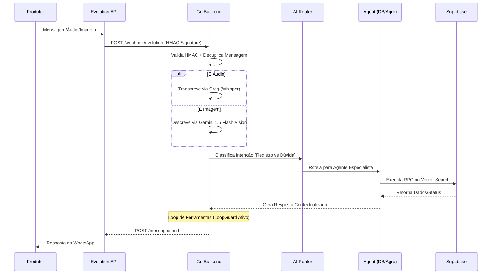
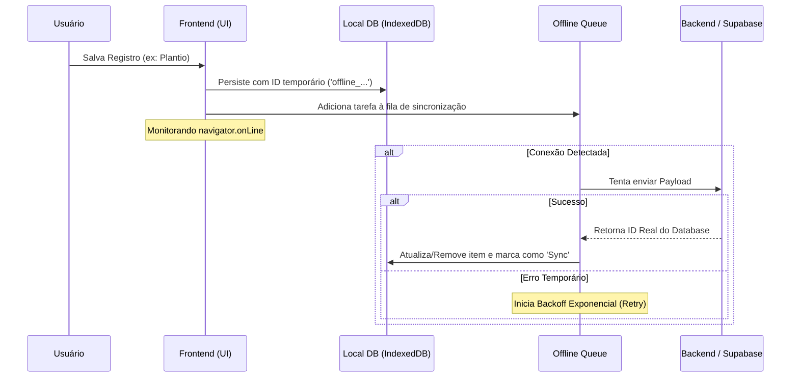
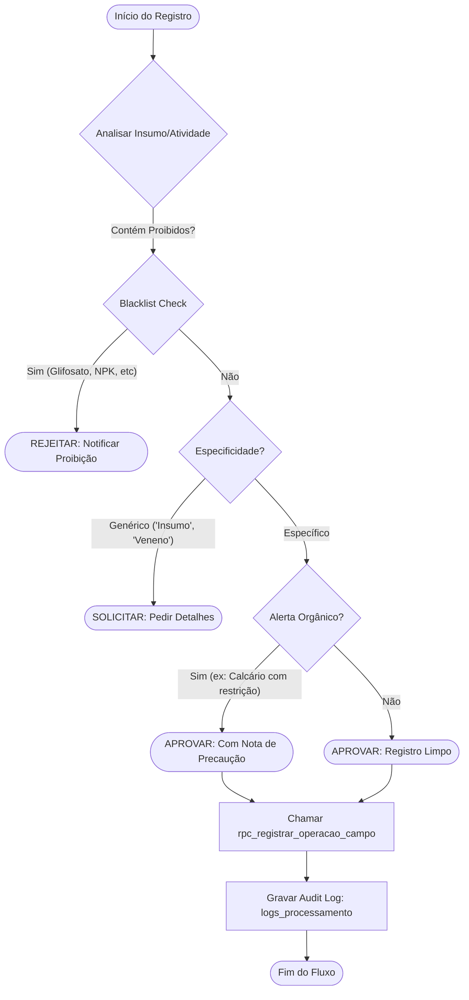

# 🔄 Fluxos de Dados

Este documento detalha os principais fluxos de informação no ecossistema ManejoORG, desde a interação do produtor até a persistência auditável no banco de dados.

## 1. Fluxo: WhatsApp → Resposta
Este é o fluxo principal de interação do sistema, orquestrado pela FSM (Finite State Machine) no backend Go.

---

## 2. Fluxo: Offline Sync (Frontend)
O sistema PWA garante a integridade dos dados mesmo sem sinal de internet no campo.

---

## 3. Fluxo: Compliance Engine
A lógica de conformidade é aplicada antes de qualquer persistência para garantir a validade dos registros orgânicos.

---

## 4. Detalhes de Implementação

### 4.1 Validação HMAC
Todas as requisições vindas da `Evolution API` são validadas usando uma chave secreta e o algoritmo HMAC-SHA256 para garantir que a origem é autêntica.

### 4.2 LoopGuard
Para evitar custos excessivos e loops infinitos da IA, o orquestrador Go mantém um contador de chamadas de ferramentas por turno. Se exceder o limite (default: 5), a IA é forçada a parar e retornar o estado atual.

### 4.3 Estratégia de Sincronização
O frontend utiliza uma estratégia de "Claim-then-Delete", onde o item é reservado na fila antes do envio. Em caso de falha persistente ou conflito de dados, o usuário é notificado via Dashboard.
