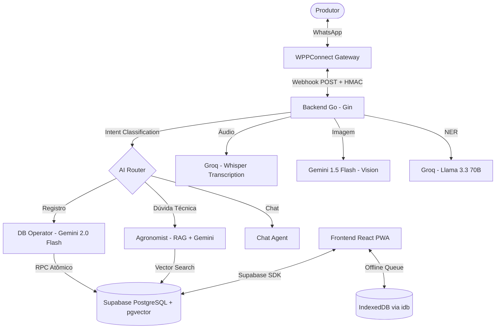

# 🏗️ Visão Geral da Arquitetura

Este documento descreve os princípios fundamentais, a organização dos componentes e as decisões técnicas que sustentam o ecossistema ManejoORG.

## 1. Princípios Arquiteturais

A arquitetura foi projetada para ser resiliente, escalável e focada na conformidade com normas orgânicas:

- **Thin Backend, Fat Database:** O backend em Go atua primariamente como um orquestrador e roteador. A lógica de negócio complexa e a integridade dos dados são garantidas por RPCs atômicas no PostgreSQL (Supabase).
- **Offline-first PWA:** Reconhecendo a instabilidade de conexão no campo, o frontend prioriza o armazenamento local (IndexedDB) e a sincronização assíncrona.
- **Multi-Agent AI com Especialização:** Em vez de um único prompt monolítico, utilizamos agentes especialistas (Agrônomo, Operador de Banco) coordenados por um roteador de intenções.
- **Compliance by Design:** A conformidade com as normas orgânicas é verificada em tempo real pela FSM antes de qualquer persistência no banco.
- **Multi-Modality Support:** O sistema suporta propriedades com produção paralela (Orgânico e Convencional). A segurança é garantida por uma triagem rápida no backend (cache) e uma validação rigorosa no banco de dados (RPCs).
- **Segurança Híbrida Zero-Trust:** Implementamos uma estratégia de defesa em profundidade onde o Go faz o bloqueio preventivo para UX rápida (feedback imediato no WhatsApp), enquanto o PostgreSQL atua como a autoridade final, rejeitando transações que violem o compliance em áreas protegidas.
- **Resiliência de Integrações (Weather):** O sistema utiliza uma estratégia multi-camada para dados externos críticos, com retries de *exponential backoff* e fallbacks automáticos entre provedores (Open-Meteo para WeatherAPI) para garantir operação em zonas rurais com latência instável.

---

## 2. Diagrama de Componentes

O diagrama abaixo ilustra a interação entre os principais serviços do sistema:

---

## 3. Stack Tecnológica

| Categoria | Tecnologia | Uso Principal |
|-----------|------------|---------------|
| **Backend** | Go 1.23+ | Orquestração, FSM, Webhooks |
| **Frontend** | React 18 / Vite | Interface PWA / Bento UI |
| **IA (Orchestrator)** | Gemini 2.0 Flash | Raciocínio, Tool Calling |
| **IA (Inference)** | Groq (Llama 3.3 / Whisper) | Transcrição e Extração NER ultra-rápida |
| **IA (Vision)** | Gemini 1.5 Flash | Análise de anexos e fotos do campo |
| **Banco de Dados** | Supabase (PostgreSQL) | Persistência, RPCs, pgvector |
| **Geolocalização** | MapLibre / Esri / Turf.js | Gestão de Talhões e Canteiros (WebGL) |
| **Clima (Weather)** | Open-Meteo / WeatherAPI | Micro-previsão com fallback e tolerância a falhas de rede |
| **Infraestrutura** | Docker / Docker Compose | Isolamento e Deploy |

---

## 4. Decisões Arquiteturais (ADRs)

### 4.1 Migração de Python para Go
- **Justificativa:** Melhor gestão de concorrência nativa (goroutines) para múltiplos webhooks simultâneos e menor footprint de memória (~20MB no Docker).
- **Status:** Implementado em Janeiro/2026.

### 4.2 Lógica Atômica via RPC (Database-First)
- **Justificativa:** Garantir que o registro de uma atividade e a atualização do Caderno de Campo ocorram em uma única transação, evitando inconsistências comuns em aplicações distribuídas.

### 4.3 Sincronização Assíncrona (Offline-first)
- **Justificativa:** Produtores rurais frequentemente operam em zonas de sombra. O uso de uma fila com backoff exponencial no frontend garante que nenhum dado seja perdido.

### 4.4 Orquestração Multi-Agente
- **Justificativa:** Separar o conhecimento normativo (Agrônomo) da capacidade de manipulação de dados (DB Operator) permite maior precisão nos prompts e evita alucinações em operações de escrita no banco.
