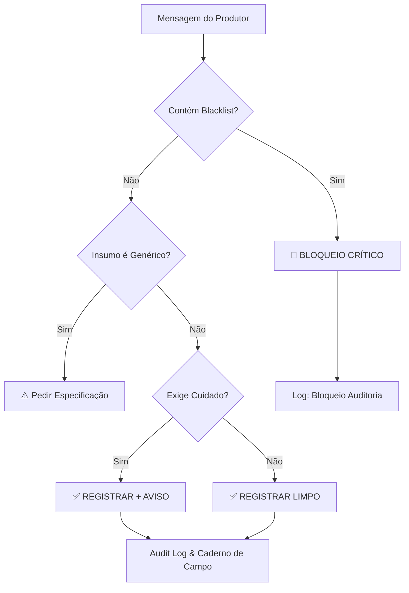

# 🛡️ Motor de Compliance — Validação Orgânica

O ManejoORG atua como um guardião da certificação, implementando regras automáticas para prevenir o uso de substâncias proibidas e garantir a qualidade dos registros do Caderno de Campo.

---

## 1. Blacklist de Substâncias Proibidas
O sistema monitora todas as mensagens de registro em busca de termos que violem as normas orgânicas (Lei 10.831 e IN 46). Caso um desses termos seja detectado (mesmo parcialmente ou em variações de escrita), o registro é **bloqueado imediatamente**.

Lista de termos monitorados (extraído de `fsm.go`):

| Termo | Categoria | Ação |
|---|---|---|
| **GLIFOSATO** | Herbicida Químico | Bloqueio Crítico |
| **UREIA** | Fertilizante Altamente Solúvel | Bloqueio Crítico |
| **NPK** | Fertilizante Químico Sintético | Bloqueio Crítico |
| **SULFATODEAMONIO** | Fertilizante Químico | Bloqueio Crítico |
| **2,4-D** | Herbicida Hormonal | Bloqueio Crítico |
| **HERBICIDA** | Categoria Proibida | Bloqueio Crítico |
| **VENENO** | Termo Genérico de Risco | Bloqueio Crítico |

---

## 2. Regras de Validação

### 2.1 Bloqueio Crítico
- **Trigger:** Presença de qualquer item da blacklist na descrição do insumo ou atividade.
- **Ação:** O bot interrompe o fluxo de gravação no banco de dados.
- **Resposta:** *"🚨 ALERTA DE NÃO-CONFORMIDADE! O uso de [Produto] parece desrespeitar as normas orgânicas. O registro foi BLOQUEADO."*

### 2.2 Regra de Especificidade
- **Trigger:** O usuário tenta registrar um "insumo" sem especificar qual (ex: "passei veneno", "usei adubo", "coloquei insumo").
- **Ação:** O bot solicita o nome específico do produto.
- **Justificativa:** A certificação exige o nome comercial ou a composição exata para rastreabilidade.
- **Exemplo:** *"Recebido! Mas poderia especificar que tipo de insumo você utilizou? (Ex: Esterco, Bokashi?)"*

### 2.3 Avisos de Precaução (Alerta Suave)
- **Trigger:** Uso de produtos que estão no "limbo" ou exigem autorização (ex: Calcário, Termofosfato, Defensivos Naturais comerciais).
- **Ação:** O registro é **permitido**, mas uma nota de rodapé é adicionada à confirmação.
- **Aviso:** *"⚠️ Nota de Precaução: Confirme se este lote específico é aprovado pela sua certificadora."*

---

## 3. Fluxo de Decisão

---

## 4. Rastreabilidade e Auditoria
Todas as decisões tomadas pelo motor de compliance são registradas na tabela `logs_processamento` do Supabase:

- **`intencao`:** Marcada como `alerta_conformidade` ou `pedido_especificidade`.
- **`metadata`:** Contém o JSON da tentativa de registro frustrada para fins de auditoria interna.
- **Auditável:** Em caso de auditoria da certificadora, o produtor pode demonstrar que o sistema auxilia na prevenção de erros de manejo.
