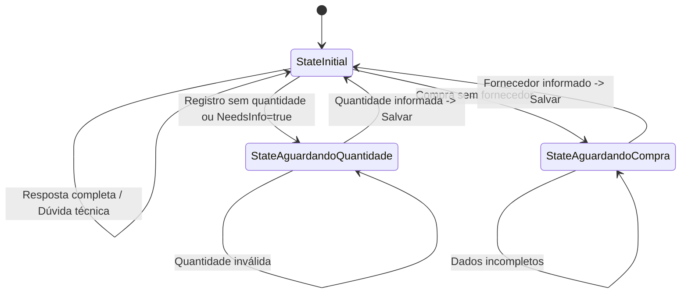

# ⚙️ FSM — Finite State Machine

## Visão Geral
A FSM (Máquina de Estados Finitos) controla o fluxo conversacional de cada produtor no WhatsApp. Ela permite que o bot "lembre" o que foi solicitado anteriormente, permitindo entrevistas ativas para completar registros que faltam informações críticas.

## Diagrama de Estados



## Tabela de Estados (pmo-bot-go)

| Estado | Nome no Código | Descrição |
|--------|----------------|-----------|
| **Inicial** | `StateInitial` ("") | Estado padrão. O bot aguarda uma nova intenção do usuário. |
| **Aguardando Quantidade** | `StateAguardandoQuantidade` | Disparado quando um registro de atividade (plantio, manejo, etc) é detectado mas a quantidade não foi extraída. |
| **Aguardando Compra** | `StateAguardandoCompra` | Disparado especificamente para "Compra/Aquisição" quando o fornecedor é omitido. |

## Tabela de Eventos e Triggers

| Evento | De → Para | Condição (Trigger) |
|--------|-----------|-------------------|
| **Choke Point Qtd** | `Initial` → `AguardandoQuantidade` | `Intencao == "registro"` AND (`Quantidade <= 0` OR `NecessitaMaisInfo == true`) |
| **Choke Point Compra** | `Initial` → `AguardandoCompra` | `Atividade == "Compra/Aquisição"` AND `Fornecedor == ""` |
| **Recovery Qtd** | `AguardandoQuantidade` → `Initial` | Usuário envia uma mensagem numérica válida (parseToFloat > 0) |
| **Recovery Compra** | `AguardandoCompra` → `Initial` | Usuário informa o nome do fornecedor/origem |

## LoopGuard (Anti-Recursão)

O sistema utiliza um mecanismo de **LoopGuard** para evitar que a IA entre em loops infinitos de chamadas de ferramentas ou gaste tokens desnecessariamente.

- **Implementação:** `internal/mcp/loopguard.go`
- **Limite de iterações:** O loop de ferramentas no `fsm.go` permite no máximo **5 iterações** por mensagem.
- **Detecção de Repetição:** O `LoopGuard` bloqueia se a mesma ferramenta for chamada com os **mesmos argumentos** mais de **2 vezes** seguidas.
- **Comportamento no Limite:** Se o limite de 5 iterações for atingido, a FSM encerra o processamento e retorna o conhecimento acumulado até aquele ponto para o usuário.

## Guia: Como Adicionar um Novo Estado

Para estender a lógica de conversação, siga os passos abaixo no repositório `pmo-bot-go`:

1. **Definir Constante:** Adicione o novo estado em `internal/state/fsm.go`:
   ```go
   const StateNovoFluxo = "novo_fluxo"
   ```
2. **Implementar o Choke Point:** No `ProcessMessage`, identifique a condição que deve levar a esse estado e salve:
   ```go
   if condicaoEspecial {
       historyManager.SetFSMState(phone, StateNovoFluxo, contextMap)
       return feedback...
   }
   ```
3. **Adicionar Handler:** No switch de `handleActiveState`, registre o novo handler:
   ```go
   case StateNovoFluxo:
       return handleNovoFluxo(ctx, body, ...)
   ```
4. **Limpeza:** Sempre chame `historyManager.ClearFSMState(phone)` após concluir o fluxo com sucesso para retornar ao estado `Initial`.
