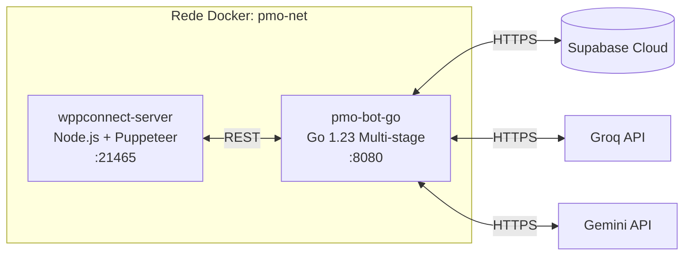

# 🐳 Docker — Configuração Local

## Arquitetura dos Containers


## docker-compose.yml Detalhado

O ecossistema é orquestrado via Docker Compose, garantindo que o gateway de WhatsApp e o motor de IA subam em sincronia.

### Serviço: `wppconnect`
O core da comunicação via WhatsApp.
- **Imagem base:** Custom baseada em Node.js com Chromium.
- **Portas expostas:** `21465` (API REST).
- **Volumes:** 
  - `./wpp-data:/data/wppconnect`: Persistência das sessões do navegador.
  - `./tokens:/usr/src/wpp-server/tokens`: Tokens de autenticação.
- **Healthcheck:** Utiliza `wget` para verificar se a documentação Swagger (`/api-docs/`) está online.
- **Notas Técnicas:** Puppeteer/Chromium é necessário para emular o WhatsApp Web em ambiente headless. Alocou-se `shm_size: '1gb'` para evitar crashes do browser.

### Serviço: `pmo-bot-go`
O cérebro do sistema (GoLang).
- **Build:** Multi-stage Dockerfile para gerar uma imagem final minimalista (Builder -> Scratch).
- **Portas expostas:** `8080`.
- **Dependência:** `depends_on: wppconnect (service_healthy)`. Só inicia após o gateway estar pronto.
- **Performance:** A imagem final tem ~20-30MB, otimizada para deploy rápido.

---

## Comandos Úteis

```bash
# Subir tudo (build forçado)
docker-compose up -d --build

# Ver logs em tempo real
docker-compose logs -f pmo-bot-go
docker-compose logs -f wppconnect

# Restart individual do cérebro
docker-compose restart pmo-bot-go

# Derrubar tudo + limpar volumes (CUIDADO: remove sessões WhatsApp)
docker-compose down -v

# Rebuild forçado sem cache
docker-compose build --no-cache
```

---

## Troubleshooting Docker

| Problema | Causa Provável | Solução |
|---|---|---|
| **WPPConnect não conecta** | QR Code expirado ou IP bloqueado | Verificar logs, re-escanear QR via dashboard WPP. |
| **Go container reinicia** | `.env` incompleto ou erro de conexão Supabase | Verificar variáveis obrigatórias em `pmo-bot-go/.env`. |
| **Porta 21465 ocupada** | Outra instância ou container órfão | `docker-compose down` seguido de `docker ps` para limpar. |
| **Chromium crash / Out of Memory** | Memória insuficiente no host/docker | Aumentar RAM disponível para o Docker (mín 2GB recomendado). |
| **Build falha no Go** | Rede ou Proxy | Tentar `docker-compose build --no-cache`. |
