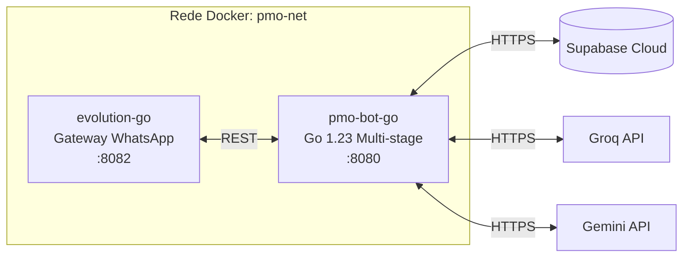

# 🐳 Docker — Configuração Local

## Arquitetura dos Containers


## docker-compose.yml Detalhado

O ecossistema é orquestrado via Docker Compose, garantindo que o gateway de WhatsApp e o motor de IA subam em sincronia.

### Serviço: `evolution-go`
O core da comunicação via WhatsApp.
- **Build:** Contexto `./evolution-go-source`.
- **Portas expostas:** `8082` (API).
- **Volumes:**
  - `./evolution_data:/data`: Persistência das sessões (sobrevive a rebuilds).
- **Dependência:** `depends_on: clockwork`.

### Serviço: `pmo-bot-go`
O cérebro do sistema (GoLang).
- **Build:** Multi-stage Dockerfile para gerar uma imagem final minimalista (Builder -> Scratch).
- **Portas expostas:** `8080`.
- **Dependência:** `depends_on: evolution-go`.
- **Performance:** A imagem final tem ~20-30MB, otimizada para deploy rápido.

---

## Comandos Úteis

```bash
# Subir tudo (build forçado)
docker-compose up -d --build

# Ver logs em tempo real
docker-compose logs -f pmo-bot-go
docker-compose logs -f evolution-go

# Restart individual do cérebro
docker-compose restart pmo-bot-go

# Derrubar tudo + limpar volumes (CUIDADO: remove sessões WhatsApp)
docker-compose down -v

# Rebuild forçado sem cache
docker-compose build --no-cache
```

---

## Troubleshooting Docker

| Problema | Causa Provável | Solução |
|---|---|---|
| **Evolution não conecta** | QR Code expirado ou IP bloqueado | Verificar logs, re-escanear QR na API/manager do evolution-go. |
| **Go container reinicia** | `.env` incompleto ou erro de conexão Supabase | Verificar variáveis obrigatórias em `pmo-bot-go/.env`. |
| **Porta 8082 ocupada** | Outra instância ou container órfão | `docker-compose down` seguido de `docker ps` para limpar. |
| **Chromium crash / Out of Memory** | Memória insuficiente no host/docker | Aumentar RAM disponível para o Docker (mín 2GB recomendado). |
| **Build falha no Go** | Rede ou Proxy | Tentar `docker-compose build --no-cache`. |
