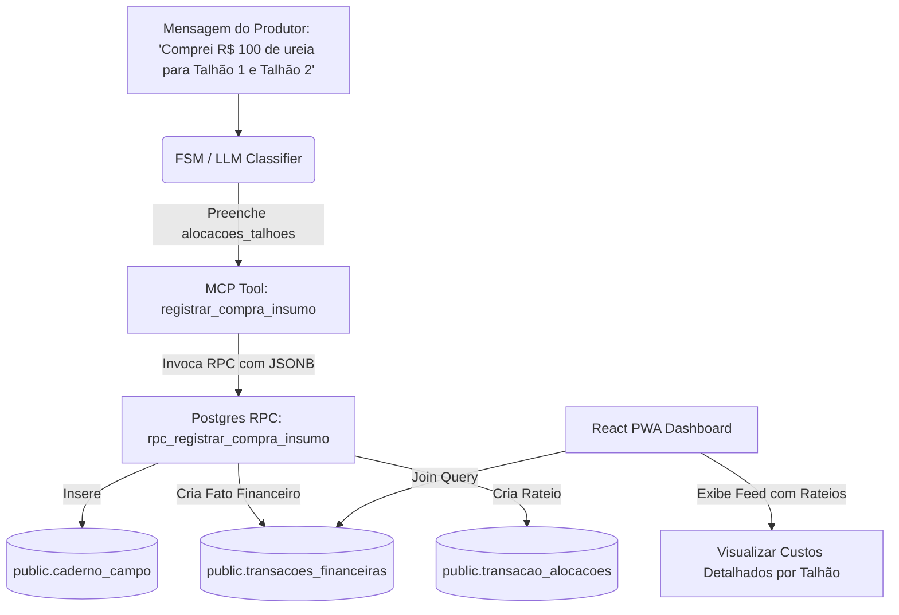

# Plano de Implementação: Rateio Financeiro (Ledger Fase 2)

Este documento descreve o plano de arquitetura e implementação para dar suporte ao rateio (split-billing) de despesas em múltiplos talhões no ecossistema **ManejoOrg**. Quando o produtor registrar uma compra informando os talhões destino, o sistema dividirá os custos de forma proporcional no ledger financeiro.

---

## 1. Arquitetura Geral do Fluxo



---

## 2. Modificações Propostas

### 2.1 Backend: Ferramentas MCP & Go

#### [MODIFY] [tools_registry.go](file:///c:/Users/brunn/Documents/PROGRAMACAO/manejo-org-app-clean/pmo-bot-go/internal/mcp/tools_registry.go)
* Adicionar o parâmetro opcional `alocacoes_talhoes` à ferramenta `registrar_compra_insumo`:

```json
"alocacoes_talhoes": {
  "type": "array",
  "description": "Lista de alocações de custos entre talhões específicos.",
  "items": {
    "type": "object",
    "properties": {
      "talhao_nome": {
        "type": "string",
        "description": "Nome do talhão (ex: 'Talhão 1', 'Canteiro A')."
      },
      "valor_alocado": {
        "type": "number",
        "description": "Valor monetário alocado para este talhão (ex: 50.00)."
      }
    },
    "required": ["talhao_nome", "valor_alocado"]
  }
}
```

#### [MODIFY] [tools_manejo.go](file:///c:/Users/brunn/Documents/PROGRAMACAO/manejo-org-app-clean/pmo-bot-go/internal/mcp/tools_manejo.go)
* No método `handleRegistrarCompraInsumo`, capturar `args["alocacoes_talhoes"]` e passar no mapa `rpcArgs` sob a chave `"alocacoes_talhoes_arg"`.

---

### 2.2 Banco de Dados: Migração Supabase / Postgres

#### [NEW] [20260607_fase2_ledger_rateio.sql](file:///c:/Users/brunn/Documents/PROGRAMACAO/manejo-org-app-clean/supabase/migrations/20260607_fase2_ledger_rateio.sql)
* Atualizar a função `public.rpc_registrar_compra_insumo` para receber o parâmetro `alocacoes_talhoes_arg JSONB DEFAULT NULL`.
* Implementar a lógica de criação da transação financeira e alocações:
  1. Identificar se há `valor_total_arg` > 0.
  2. Inserir despesa em `public.transacoes_financeiras` vinculada à categoria `'Insumos'`.
  3. Se `alocacoes_talhoes_arg` estiver populado:
     * Iterar sobre o array JSONB.
     * Resolver o `talhao_id` correspondente buscando por `nome ILIKE` e vinculação à propriedade ativa.
     * Gravar o rateio em `public.transacao_alocacoes` associando o `caderno_campo_id` gerado.
  4. Caso contrário (sem rateio explícito), criar uma alocação padrão de 100% (sem talhão específico).

```sql
CREATE OR REPLACE FUNCTION public.rpc_registrar_compra_insumo(
    pmo_id_arg bigint, 
    propriedade_id_arg bigint,
    user_id_arg uuid, 
    produto_arg text, 
    quantidade_valor_arg numeric, 
    quantidade_unidade_arg text, 
    fornecedor_arg text DEFAULT NULL::text, 
    data_compra_arg date DEFAULT CURRENT_DATE, 
    nota_fiscal_arg text DEFAULT NULL::text, 
    marca_arg text DEFAULT NULL::text, 
    composicao_arg text DEFAULT NULL::text, 
    procedencia_arg text DEFAULT NULL::text,
    valor_total_arg numeric DEFAULT 0,
    alocacoes_talhoes_arg jsonb DEFAULT NULL
)
 RETURNS jsonb
 LANGUAGE plpgsql
 SECURITY DEFINER
AS $function$
DECLARE
    v_insumo_id UUID;
    v_compra_id UUID;
    v_transacao_id UUID;
    v_detalhes JSONB;
    v_alocacao JSONB;
    v_talhao_id BIGINT;
    v_categoria_insumos_id UUID;
BEGIN
    -- 1. Garantir insumo no catálogo (Seção 8)
    INSERT INTO public.pmo_insumos (pmo_id, produto_manejo, marca, composicao, procedencia)
    VALUES (pmo_id_arg, produto_arg, marca_arg, composicao_arg, procedencia_arg)
    ON CONFLICT (pmo_id, produto_manejo) DO UPDATE SET
        marca = COALESCE(EXCLUDED.marca, pmo_insumos.marca)
    RETURNING id INTO v_insumo_id;

    v_detalhes := jsonb_build_object('insumo_id', v_insumo_id, 'nota_fiscal', nota_fiscal_arg);

    -- 2. Registrar compra operacional
    INSERT INTO public.caderno_campo (
        pmo_id, propriedade_id, user_id, tipo_atividade, data_registro, 
        produto, quantidade_valor, quantidade_unidade, fornecedor, nota_fiscal, detalhes_tecnicos
    )
    VALUES (
        pmo_id_arg, propriedade_id_arg, user_id_arg, 'Compra', data_compra_arg,
        produto_arg, quantidade_valor_arg, quantidade_unidade_arg, fornecedor_arg, nota_fiscal_arg, v_detalhes
    )
    RETURNING id INTO v_compra_id;

    -- 3. Se houver valor financeiro, criar fato financeiro e alocações (Ledger)
    IF valor_total_arg > 0 THEN
        SELECT id INTO v_categoria_insumos_id FROM public.categorias_financeiras WHERE nome = 'Insumos' LIMIT 1;

        INSERT INTO public.transacoes_financeiras (
            pmo_id, propriedade_id, categoria_id, tipo, valor_total, data_competencia, fornecedor_cliente, nota_fiscal, user_id
        )
        VALUES (
            pmo_id_arg, propriedade_id_arg, v_categoria_insumos_id, 'DESPESA', valor_total_arg, data_compra_arg, fornecedor_arg, nota_fiscal_arg, user_id_arg
        )
        RETURNING id INTO v_transacao_id;

        -- Registrar rateio nos talões
        IF alocacoes_talhoes_arg IS NOT NULL AND jsonb_typeof(alocacoes_talhoes_arg) = 'array' THEN
            FOR v_alocacao IN SELECT * FROM jsonb_array_elements(alocacoes_talhoes_arg)
            LOOP
                -- Resolver id do talhão pelo nome de forma flexível
                SELECT id INTO v_talhao_id FROM public.talhoes 
                WHERE nome ILIKE (v_alocacao->>'talhao_nome') AND propriedade_id = propriedade_id_arg LIMIT 1;

                INSERT INTO public.transacao_alocacoes (
                    transacao_id, talhao_id, caderno_campo_id, valor_alocado, percentual_alocado
                )
                VALUES (
                    v_transacao_id, v_talhao_id, v_compra_id, (v_alocacao->>'valor_alocado')::NUMERIC,
                    ((v_alocacao->>'valor_alocado')::NUMERIC / valor_total_arg) * 100
                );
            END LOOP;
        ELSE
            -- Alocação global sem talhão específico (100%)
            INSERT INTO public.transacao_alocacoes (
                transacao_id, caderno_campo_id, valor_alocado, percentual_alocado
            )
            VALUES (v_transacao_id, v_compra_id, valor_total_arg, 100.00);
        END IF;
    END IF;

    RETURN jsonb_build_object(
        'status', 'success',
        'compra_id', v_compra_id,
        'transacao_id', v_transacao_id
    );
END;
$function$;
```

---

### 2.3 Frontend: Exibição no React

#### [MODIFY] [financeiroTypes.ts](file:///c:/Users/brunn/Documents/PROGRAMACAO/manejo-org-app-clean/pmo-frontend/src/domain/financeiro/financeiroTypes.ts)
* Atualizar a interface `TransacaoFinanceira` para receber a lista de alocações:

```typescript
export interface TransacaoAlocacao {
    id: string;
    talhao_id?: number;
    talhao_nome?: string;
    valor_alocado: number;
    percentual_alocado: number;
}

export interface TransacaoFinanceira {
    // ... campos existentes ...
    alocacoes?: TransacaoAlocacao[];
}
```

#### [MODIFY] [useTransacoes.ts](file:///c:/Users/brunn/Documents/PROGRAMACAO/manejo-org-app-clean/pmo-frontend/src/hooks/financeiro/useTransacoes.ts)
* Ajustar a query do Supabase para trazer as alocações e realizar o mapeamento correto no array retornado:

```typescript
const { data, error: sbError } = await supabase
    .from('transacoes_financeiras')
    .select(`
        *,
        categorias_financeiras ( nome ),
        transacao_alocacoes (
            id,
            talhao_id,
            valor_alocado,
            percentual_alocado,
            talhoes ( nome )
        )
    `)
// ... mapeamento populando a lista de alocacoes
```

#### [MODIFY] [TransacoesTable.tsx](file:///c:/Users/brunn/Documents/PROGRAMACAO/manejo-org-app-clean/pmo-frontend/src/components/Financeiro/TransacoesTable.tsx)
* Modificar a visualização do histórico. Transações que possuem mais de uma alocação devem exibir uma etiqueta de **"Rateado"** e, ao passar o mouse ou expandir, exibir o detalhamento de quanto foi distribuído para cada talhão.

---

## 3. Plano de Verificação

### Testes de Banco de Dados
* Executar a RPC `rpc_registrar_compra_insumo` diretamente no Supabase passando um payload com múltiplos talhões e verificar se os registros são inseridos em `transacoes_financeiras` e `transacao_alocacoes` na proporção declarada.

### Testes de Fluxo Completo (Bot)
* Enviar a mensagem: *"Comprei R$ 1500 de adubo orgânico, alocando R$ 900 para o Talhão 1 e R$ 600 para o Talhão 2."*
* Verificar via logs se a ferramenta é chamada com o array `alocacoes_talhoes` estruturado e se o banco executa com sucesso.

### Testes do Frontend
* Acessar o módulo financeiro no painel React e validar que os custos aparecem rateados por talhão na tabela do Ledger Feed.
