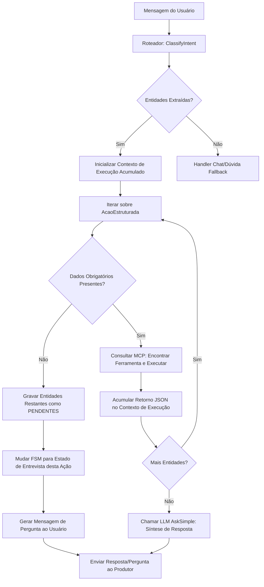

# Plano de Execução: NER Multimodal (Múltiplas Intenções - Fase 3)

Este plano descreve as modificações necessárias no ecossistema **ManejoOrg** para refatorar o Classificador de Intenções (Router) e a Máquina de Estados (FSM) de modo a suportar o processamento de múltiplas intenções agrícolas e financeiras a partir de uma única mensagem composta do produtor.

---

## 1. Modificações de Tipos e JSON Schemas

### 1.1 Atualização de `UnifiedIntentResult` (`pmo-bot-go/internal/llm/types.go`)

Modificaremos o campo `Intent` singular para um array `Intents []Intent`, permitindo que o roteador de intenções classifique simultaneamente fluxos como `DATABASE` (operações agrícolas) e `REGISTRO_FINANCEIRO` (despesas/receitas) ou `RAG` (perguntas técnicas).

```go
type Intent string

const (
	IntentRAG               Intent = "RAG"
	IntentDatabase          Intent = "DATABASE"
	IntentFinance           Intent = "REGISTRO_FINANCEIRO"
	IntentChat              Intent = "CHAT"
)

// UnifiedIntentResult combina a classificação multi-intenção com a extração NER de entidades.
type UnifiedIntentResult struct {
	Intents    []Intent  `json:"intents" jsonschema:"required,minItems=1,enum=RAG,enum=DATABASE,enum=CHAT,enum=REGISTRO_FINANCEIRO" validate:"required,min=1,dive,oneof=RAG DATABASE CHAT REGISTRO_FINANCEIRO"`
	Confidence float64   `json:"confidence" jsonschema:"required,minimum=0,maximum=1" validate:"required,gte=0,lte=1"`
	Reasoning  string    `json:"reasoning" jsonschema:"required,description=Explicação técnica da segmentação de intenções e das entidades extraídas" validate:"required"`
	Entities   []AcaoEstruturada `json:"entidades" jsonschema:"minItems=1,description=Lista de ações independentes detectadas na mensagem."`
}
```

---

## 2. Fluxograma Lógico da FSM Iterativa

A FSM (`fsm.go`) será refatorada para iterar sobre a lista de entidades extraídas. Para cada ação, o sistema consultará o MCP para descobrir as ferramentas necessárias, acumulará os contextos de execução e gerará uma única resposta de síntese no final.



---

## 3. Lógica de Execução e Orquestração do FSM (`fsm.go`)

### 3.1 Resolução e Mapeamento de Ferramentas via MCP
O sistema resolverá a ferramenta dinamicamente inspecionando o campo `Intencao` e os parâmetros de `AcaoEstruturada`:
*   `Intencao = "registro"`:
    *   Se `Atividade = "Colheita"` -> ferramenta `registrar_colheita`
    *   Se `Atividade = "Venda"` -> ferramenta `registrar_venda`
    *   Se `Atividade = "Compra"` ou `Atividade = "Compra/Aquisição"` -> ferramenta `registrar_compra_insumo`
*   `Intencao = "limpeza"`: ferramenta `registrar_limpeza`
*   `Intencao = "compostagem"`: ferramenta `registrar_compostagem`
*   `Intencao = "registro_financeiro"`: ferramenta `rpc_registrar_transacao_com_rateio`
*   `Intencao = "duvida"`: ferramenta `consultar_base_conhecimento`

### 3.2 Loteamento e Acumulação de Contexto
A execução das ferramentas será sequencial. O resultado de cada execução de ferramenta será armazenado em um buffer estruturado de contexto:

```go
type ExecucaoAcao struct {
    Indice     int                    `json:"indice"`
    Acao       string                 `json:"acao"`
    Status     string                 `json:"status"` // "sucesso" | "erro" | "pendente"
    Ferramenta string                 `json:"ferramenta"`
    Resultado  map[string]interface{} `json:"resultado"`
}
```

Este histórico de execuções da transação será enviado para a função de síntese da LLM (`gemini.Client` ou `llm.AskSimple`) junto com a mensagem original do produtor para gerar a resposta amigável e unificada.

---

## 4. Cenários de Teste Unitário (`internal/state/fsm_test.go`)

Para garantir a robustez contra regressões, criaremos testes unitários cobrindo os seguintes cenários:

| ID | Mensagem Input | Entidades Extraídas Esperadas | Execuções de Ferramentas Esperadas | Resultado Esperado do WhatsApp |
| :--- | :--- | :--- | :--- | :--- |
| **TC01** | *"Colhi 20 caixas de tomate na Gleba A e gastei R$ 200 de adubo"* | 1. Colheita (tomate, 20 caixas, Gleba A)<br>2. Compra (adubo, R$ 200) | 1. `registrar_colheita`<br>2. `registrar_compra_insumo` | Síntese de sucesso para ambas as operações. |
| **TC02** | *"Comprei R$ 500 de ureia e qual o espaçamento do milho?"* | 1. Compra (ureia, R$ 500)<br>2. Dúvida (milho, espaçamento) | 1. `registrar_compra_insumo`<br>2. `consultar_base_conhecimento` | Registro da compra efetuado + Resposta técnica sobre o espaçamento do milho. |
| **TC03** | *"Colhi tomate na Gleba A e gastei R$ 100 com sementes"* | 1. Colheita (tomate, Gleba A - SEM QTD)<br>2. Compra (sementes, R$ 100) | 1. `registrar_compra_insumo` (Executa e salva)<br>2. `registrar_colheita` (Pausa: missing quantity) | Registro de compra salvo. Pergunta: *"Qual a quantidade colhida de tomate na Gleba A?"*. FSM entra em `StateAguardandoQuantidade`. |

---

## 5. Cronograma de Implementação (Fase 3)

1.  **Tarefa 3.1**: Modificar `UnifiedIntentResult` em `internal/llm/types.go` e atualizar o parse de esquemas em `internal/gemini/client.go`.
2.  **Tarefa 3.2**: Refatorar o prompt do roteador em `internal/prompt/prompts/router.txt` com exemplos few-shot de frases compostas.
3.  **Tarefa 3.3**: Refatorar `fsm.go` para implementar o loop iterativo, mapeador de ferramentas MCP, e acumulador de contexto.
4.  **Tarefa 3.4**: Implementar prompt de síntese final e chamada `AskSimple`.
5.  **Tarefa 3.5**: Criar a suíte de testes unitários em `fsm_test.go` para validar os casos híbridos e o estado de entrevista parcial.

---
**Elaborado por @architect & @backend-specialist.**
