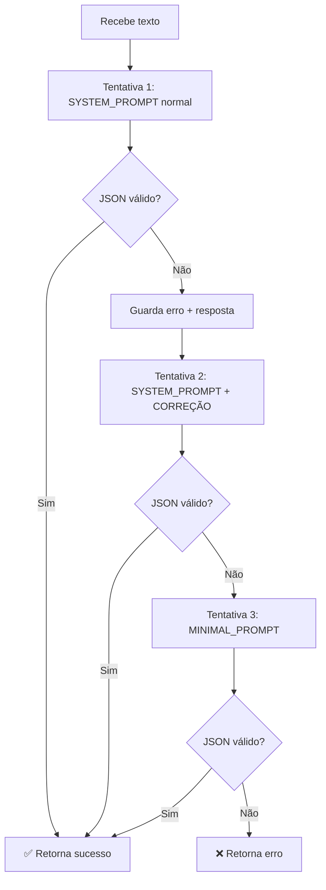

# Plano de Refatoração: AI Retry com Progressive Prompting

**Data:** 2026-01-12  
**Baseado em:** [ai-retry-research.md](file:///C:/Users/brunn/.gemini/antigravity/brain/ba23ec70-23fa-42cd-a903-51e9cf471cb8/ai-retry-research.md)

---

## 📋 Resumo Executivo

Refatorar o mecanismo de retry da IA para usar **progressive prompting**: cada tentativa ajusta o prompt conforme o erro anterior, aumentando a chance de sucesso sem desperdiçar tokens.

---

## 🎯 Requisitos

| Requisito | Descrição |
|-----------|-----------|
| Máximo de tentativas | 3 |
| Tentativa 1 | Prompt normal (SYSTEM_PROMPT) |
| Tentativa 2 | Adiciona instrução de correção ("sua resposta anterior não era JSON válido…") |
| Tentativa 3 | Prompt mínimo (apenas campos essenciais) |
| Feedback de erro | JSONDecodeError alimenta a próxima tentativa |

---

## 📁 Arquivos Afetados

### [MODIFY] [prompts.py](file:///c:/Users/brunn/Documents/PROGRAMAÇÃO/manejo-org-app-clean/pmo_bot/modules/prompts.py)

Adicionar dois novos prompts:

```python
# Novo: Prompt de correção (tentativa 2)
RETRY_CORRECTION_PROMPT = """
⚠️ SUA RESPOSTA ANTERIOR NÃO FOI UM JSON VÁLIDO.

ERRO: {error_message}
RESPOSTA ANTERIOR (trecho): {previous_response}

CORRIJA e retorne APENAS o JSON. Sem explicações, sem markdown.
Formate assim:
{{"tipo_atividade": "...", "produto": "...", ...}}
"""

# Novo: Prompt mínimo (tentativa 3)
MINIMAL_PROMPT = """
Extraia dados da mensagem e retorne JSON com estes campos OBRIGATÓRIOS:
{
  "tipo_atividade": "Plantio" | "Manejo" | "Colheita" | "Outro",
  "produto": "NOME (uppercase)",
  "data_registro": "YYYY-MM-DD",
  "quantidade_valor": 0,
  "quantidade_unidade": "kg" | "unid" | "L"
}
NENHUM TEXTO EXTRA. APENAS O JSON.
"""
```

---

### [MODIFY] [ai_processor.py](file:///c:/Users/brunn/Documents/PROGRAMAÇÃO/manejo-org-app-clean/pmo_bot/modules/ai_processor.py)

#### 1. Nova função utilitária `call_llm_with_retries`

```python
from modules.prompts import SYSTEM_PROMPT, RETRY_CORRECTION_PROMPT, MINIMAL_PROMPT

def call_llm_with_retries(
    client_groq: Groq,
    user_text: str,
    max_attempts: int = 3
) -> dict:
    """
    Chama a LLM com progressive prompting.
    
    Returns:
        dict: {"success": True, "data": {...}} ou {"success": False, "error": "..."}
    """
    last_error = None
    last_response = None
    
    for attempt in range(1, max_attempts + 1):
        try:
            # Escolhe prompt baseado na tentativa
            if attempt == 1:
                system_prompt = SYSTEM_PROMPT
            elif attempt == 2:
                # Injeta erro anterior no prompt de correção
                system_prompt = SYSTEM_PROMPT + "\n\n" + RETRY_CORRECTION_PROMPT.format(
                    error_message=str(last_error)[:100],
                    previous_response=(last_response or "")[:200]
                )
            else:  # attempt == 3
                system_prompt = MINIMAL_PROMPT
            
            print(f"🤖 IA Pensando (Tentativa {attempt}/{max_attempts})...")
            
            response = client_groq.chat.completions.create(
                model="llama-3.3-70b-versatile",
                messages=[
                    {"role": "system", "content": system_prompt},
                    {"role": "user", "content": user_text}
                ],
                temperature=0.0,
                max_tokens=600
            )
            
            raw_response = response.choices[0].message.content.strip()
            last_response = raw_response  # Guarda para próxima tentativa
            
            # Limpa markdown
            clean_response = _clean_markdown(raw_response)
            
            # Extrai e parseia JSON
            json_data = _extract_json(clean_response)
            
            if json_data:
                return {"success": True, "data": json_data, "attempts": attempt}
            else:
                last_error = "JSON não encontrado na resposta"
                
        except json.JSONDecodeError as e:
            last_error = f"JSONDecodeError: {e.msg} na posição {e.pos}"
            print(f"⚠️ Tentativa {attempt}: {last_error}")
            
        except Exception as e:
            last_error = str(e)
            print(f"❌ Tentativa {attempt}: Erro inesperado - {last_error}")
    
    return {"success": False, "error": last_error, "attempts": max_attempts}


def _clean_markdown(text: str) -> str:
    """Remove blocos de código markdown."""
    if "```json" in text:
        return text.split("```json")[1].split("```")[0].strip()
    elif "```" in text:
        return text.split("```")[1].split("```")[0].strip()
    return text


def _extract_json(text: str) -> dict | None:
    """Extrai primeiro objeto JSON válido do texto."""
    match = re.search(r'\{.*\}', text, re.DOTALL)
    if match:
        return json.loads(match.group(0))
    return None
```

---

#### 2. Refatorar `processar_ia` para usar a nova função

```python
def processar_ia(texto_usuario, user_id=None, client_groq=None, system_prompt=None):
    if not client_groq:
        api_key = os.getenv("GROQ_API_KEY")
        if not api_key:
            return None
        client_groq = Groq(api_key=api_key)
    
    # Delega para nova função
    result = call_llm_with_retries(client_groq, texto_usuario, max_attempts=3)
    
    if not result["success"]:
        return {"status": "error", "message": result["error"]}
    
    dados_ia = result["data"]
    print(f"🔍 DEBUG: Sucesso após {result['attempts']} tentativa(s)")
    
    # Validação (código existente mantido)
    dados_validados = validar_e_normalizar_json(dados_ia, user_id=user_id)
    
    if dados_validados.get("_bloqueio"):
        return {
            "status": "blocked",
            "message": dados_validados["_bloqueio"],
            "data": dados_validados
        }
    
    return {"status": "success", "data": dados_validados}
```

---

## 🔄 Fluxo de Tentativas



---

## ✅ Plano de Verificação

### Testes Automatizados

> [!IMPORTANT]
> Rodar todos os testes do diretório `pmo_bot/`:

```bash
cd c:\Users\brunn\Documents\PROGRAMAÇÃO\manejo-org-app-clean\pmo_bot
python -m pytest tests/ test_compliance_flow.py -v
```

#### Novos testes a adicionar em `tests/test_ai_retry.py`:

| Teste | Cenário | Expectativa |
|-------|---------|-------------|
| `test_success_first_attempt` | Mock retorna JSON válido na 1ª | `attempts == 1` |
| `test_success_after_correction` | Mock falha 1x, sucesso na 2ª | `attempts == 2` |
| `test_success_minimal_prompt` | Mock falha 2x, sucesso na 3ª | `attempts == 3` |
| `test_all_attempts_fail` | Mock sempre retorna texto inválido | `success == False` |
| `test_json_decode_error_captured` | Mock retorna `{"broken` | Erro informado na tentativa 2 |

---

### Testes Manuais

#### Teste 1: Resposta normal (sem retry)
1. Reiniciar o webhook: `python webhook.py`
2. Enviar via WhatsApp: `Plantei 50 mudas de alface no canteiro A`
3. **Esperado:** Resposta processada, log mostra `Sucesso após 1 tentativa(s)`

#### Teste 2: Simular resposta inválida
1. Temporariamente editar `SYSTEM_PROMPT` para instruir: `"Retorne apenas a frase: isso não é json"`
2. Enviar mensagem qualquer
3. **Esperado:** 
   - Log mostra tentativas 1, 2, 3
   - Na tentativa 2, log deve mostrar "sua resposta anterior não era JSON válido"
   - Na tentativa 3, usa prompt mínimo
4. Reverter `SYSTEM_PROMPT`

#### Teste 3: Verificar que não excede 3 tentativas
1. Verificar nos logs que após 3 falhas, o sistema para e retorna erro
2. **Esperado:** Mensagem `{"status": "error", "message": "..."}`

---

## 📊 Comparação Antes vs Depois

| Aspecto | Antes | Depois |
|---------|-------|--------|
| Prompt por tentativa | Mesmo | Progressivo |
| JSONDecodeError | Genérico | Capturado e informado |
| Feedback para IA | Nenhum | Erro + trecho anterior |
| Testabilidade | Baixa | Alta (função isolada) |
| Parâmetro `system_prompt` | Ignorado | Removido (não usado) |

---

## 🚀 Ordem de Implementação

1. `prompts.py` - Adicionar novos prompts
2. `ai_processor.py` - Adicionar funções auxiliares (`_clean_markdown`, `_extract_json`)
3. `ai_processor.py` - Adicionar `call_llm_with_retries`
4. `ai_processor.py` - Refatorar `processar_ia`
5. `tests/test_ai_retry.py` - Criar suite de testes
6. Rodar testes automatizados
7. Testes manuais via WhatsApp
